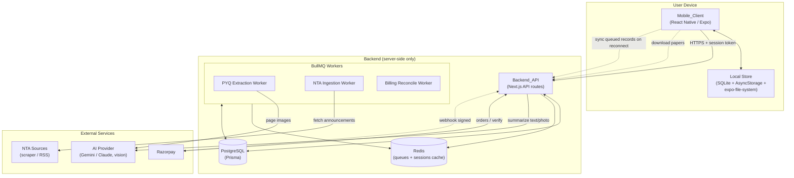
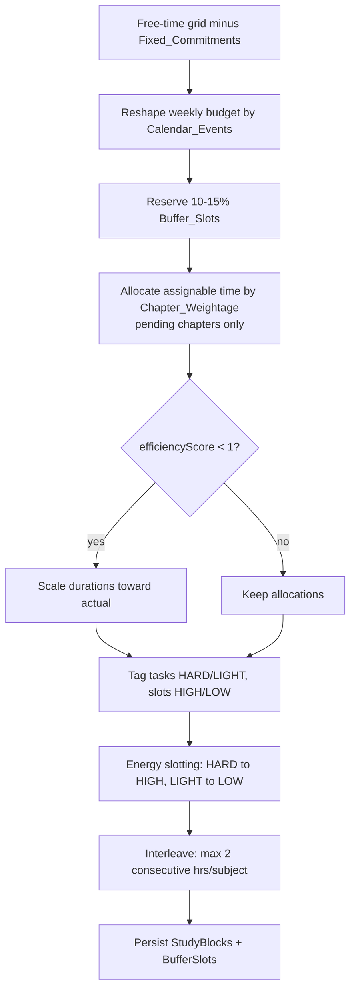

# Design Document

## Overview

The JEE/NEET Study Companion ("the System") is a mobile-first study-productivity product for Indian JEE and NEET aspirants. Its differentiator is a living, behavior-responsive study layer (weightage-aware timetable, energy-based slotting, adaptive rebalancing, focus timer, progress and velocity tracking) combined with PYQ practice scored against official answer keys, a categorized mistake journal, an AI notes summarizer, and an NTA announcement feed.

This document specifies the **Phase 1 MVP** technical design covering all 21 approved requirements. The System comprises two deployable parts:

- **Mobile_Client** — a React Native (Expo) application, the only user-facing surface. Distributed via EAS Build/Submit with OTA updates. Provides read-only offline support for downloaded PYQs and the focus timer.
- **Backend_API** — a server-side-only Next.js API-routes service (no web frontend pages) backed by PostgreSQL (via Prisma), with Redis + BullMQ workers for the PYQ extraction pipeline and NTA ingestion, a vision-capable AI provider (Gemini/Claude) for summarization and extraction, and Razorpay for subscription payments.

**Phase 1 scope implemented here:** accounts/auth (Req 1), onboarding + reference data load (Req 2), timetable generation and editing (Req 3), focus timer with session type (Req 4), progress dashboard (Req 5), PYQ practice + scoring (Req 6), PYQ extraction pipeline (Req 7), AI notes summarizer (Req 8), monetization/quota gating (Req 9), bilingual support (Req 10), weightage-aware scheduling (Req 11), chapter time estimation + syllabus completion (Req 12), energy-based slotting (Req 13), daily time audit + study velocity (Req 14), buffer slots + adaptive rebalancer (Req 15), holiday/exam mode (Req 16), subject interleaving (Req 17), mistake journal (Req 18), timed paper mode (Req 19), NTA update feed (Req 20), and read-only offline mode + idempotent sync (Req 21).

**Explicitly NOT designed here (non-goals):** spaced-repetition reminders, burnout detection, per-Session_Type analytics surface, full NTA mock-test clone, push notifications, score-trajectory/rank prediction, weak-area detection, and the AI Daily Briefing north-star. The design leaves clean seams (described in Architecture) so these plug in later without rework. In particular, every Phase 1 signal source (timetable adherence, PYQ/timed performance, chapter completion, mistake journal, velocity, session type) is persisted in a queryable, user-scoped form so a future briefing/analytics service can read them without schema migration.

## Architecture

### High-Level Architecture



### Client/Server Split

- The **Mobile_Client owns all UI/UX, local timing, and offline storage.** It never computes authoritative scores, timetable allocations, quotas, or streaks; those are Backend_API responsibilities so that results are consistent and tamper-resistant. The client may show optimistic local state (e.g., a running timer) but the Backend_API is the source of truth on `record`/`sync`.
- The **Backend_API owns all persistence, scoring, generation algorithms, quota accounting, and authorization.** It exposes a REST-style JSON API over HTTPS. There is no server-rendered web frontend.
- **Reference_Data** (chapters, weightage, estimated hours, target exam dates per track/year) is seeded server-side and loaded into a user's profile at onboarding.

### Authentication Posture

All endpoints are network-exposed and **require a valid session token** (Authorization: `Bearer <token>`) **except** the following explicitly unauthenticated endpoints:

- `POST /auth/register` — creates an account (Req 1.1).
- `POST /auth/login` — exchanges credentials for a session token (Req 1.4).
- `POST /webhooks/razorpay` — unauthenticated by session, but **authenticated by Razorpay webhook signature verification** (see Security Considerations). It accepts no user session and acts only on signature-verified payloads.

Every other endpoint MUST reject requests lacking a valid session token with an authorization error (Req 1.7), and MUST scope all data access to the authenticated user (per-user isolation). The NTA scraper and AI provider calls are server-to-server and never exposed to clients.

### Offline-Sync Approach (Req 21)

Phase 1 offline support is **read-only for content** and **queue-and-forward for captured activity**:

1. The client downloads a `PYQ_Paper` + `Answer_Key` bundle to device storage (`expo-file-system` for any media, SQLite for structured rows) as an `Offline_Download`.
2. While offline, the client serves downloaded papers and runs the focus timer using local timing. AI summarizer and NTA feed are surfaced as unavailable (Req 21.6).
3. Activities captured offline (`Focus_Session`, `PYQ_Attempt`, `Timed_Paper_Attempt`) are written to a local outbox as `Local_Sync_Record`s, each stamped with a **client-generated UUID (`clientId`)**.
4. On reconnect, the client POSTs the outbox to a sync endpoint. The Backend_API performs **idempotent upsert keyed by `(userId, clientId)`** so re-sending the same record never creates a duplicate (Req 21.5). The server returns canonical server IDs and computed scores, which the client reconciles back into local state.

This is intentionally **one-directional (client → server) for activity** and read-only for content; full bidirectional sync is a Phase 3 non-goal. The `clientId` column and outbox pattern are the architectural seam that a later bidirectional design can reuse.

### Background-Job Model

Redis + BullMQ host three queues:

- **`pyq-extraction`** — processes uploaded PYQ source page images through the AI vision model into structured PYQ records, reconciled against the official answer key (Req 7). Jobs are operator-triggered (content pipeline), not user-facing.
- **`nta-ingestion`** — a repeatable (cron-style) job that fetches, validates, sanitizes, de-duplicates, and stores NTA announcements, and applies exam-date changes (Req 20).
- **`billing-reconcile`** — handles the post-payment upgrade transaction and the refund-on-upgrade-failure compensation (Req 9.6) outside the request path so payment success and tier grant are decoupled and retryable.

Workers are idempotent and use BullMQ retry/backoff. Failed jobs land in a dead-letter set for operator review.

### Architectural Seams for Deferred Features

| Deferred feature | Seam preserved in Phase 1 |
|---|---|
| AI Daily Briefing (north-star) | All signals (audits, velocity, completion, mistakes, attempts, session types) stored user-scoped and timestamped; a future read-only `BriefingService` can aggregate without schema change. |
| Push notifications | NTA announcements, exam-date changes, and missed-session detection already persisted as events; a notification dispatcher can subscribe later. |
| Weak-area detection / per-Session_Type analytics | `Session_Type` persisted on every `FocusSession`; `Mistake_Category` and per-question outcomes persisted; analytics can read these. |
| Score trajectory | `PYQAttempt` / `TimedPaperAttempt` store full per-question outcomes and timing for later projection. |
| Full bidirectional sync | `clientId` idempotency keys and the outbox pattern generalize to two-way sync. |

## Components and Interfaces

All endpoints are prefixed `/api` (omitted below for brevity), return JSON, and (except where noted) require `Authorization: Bearer <token>`. Request/response shapes are indicative, not exhaustive.

### 1. Auth Service (Req 1)

Responsibilities: registration, login, password hashing (argon2id or bcrypt), session-token issuance/validation, protected-route guard middleware.

| Method | Path | Request | Response |
|---|---|---|---|
| POST | `/auth/register` *(unauth)* | `{ email, password }` | `201 { token, user }` / `409` duplicate / `422` weak password |
| POST | `/auth/login` *(unauth)* | `{ email, password }` | `200 { token, user }` / `401` invalid |
| POST | `/auth/logout` | — | `204` |
| GET | `/auth/me` | — | `200 { user, profileComplete }` |

### 2. Onboarding / Profile Service (Req 2, 10)

Responsibilities: persist exam track, target year, class, fixed commitments, peak focus windows, language preference; trigger subject + reference-data association; expose onboarding completeness.

| Method | Path | Request | Response |
|---|---|---|---|
| POST | `/onboarding` | `{ examTrack, targetYear, currentClass, fixedCommitments[], peakFocusWindows[] }` | `200 { profile }` / `422` (year < current year, or commitment end ≤ start) |
| GET | `/profile` | — | `200 { profile }` |
| PATCH | `/profile/language` | `{ language: "EN"|"HI" }` | `200 { profile }` |
| PATCH | `/profile/peak-windows` | `{ windows: PeakFocusWindow[] }` | `200 { profile }` |
| POST | `/profile/fixed-commitments` | `{ dayOfWeek, startTime, endTime, label }` | `201` / `422` end ≤ start |
| DELETE | `/profile/fixed-commitments/:id` | — | `204` |

On exam-track selection the service loads Reference_Data chapters, weightage, and estimated hours and initializes each Chapter_Status to Not Started (Req 2.7). If subject association fails, the track selection is preserved and onboarding continues (Req 2.5).

### 3. Reference Data Service (Req 2.7, 11, 12, 14.6, 20.6)

Responsibilities: serve system-seeded, track-keyed chapter catalog (weightage, estimated hours, task difficulty), and target exam dates per track/year. Read-mostly; updated by seed scripts and NTA ingestion (exam dates).

| Method | Path | Request | Response |
|---|---|---|---|
| GET | `/reference/subjects?track=JEE` | — | `200 { subjects[] }` |
| GET | `/reference/chapters?track=JEE` | — | `200 { chapters[] }` |
| GET | `/reference/exam-date?track=JEE&year=2026` | — | `200 { targetExamDate }` |

### 4. Chapter / Syllabus Tracking Service (Req 12)

Responsibilities: per-user chapter status lifecycle, status transition enforcement, syllabus-completion computation, weightage/hours overrides.

| Method | Path | Request | Response |
|---|---|---|---|
| GET | `/chapters` | — | `200 { chapters[] }` (status, weightage, estHours, overrides) |
| PATCH | `/chapters/:id/status` | `{ status }` | `200` / `422` illegal transition |
| PATCH | `/chapters/:id/override` | `{ weightageOverride?, estHoursOverride?, timeAllocationOverride? }` | `200` |
| DELETE | `/chapters/:id/override` | — | `204` (clears override, Req 11.4) |
| GET | `/syllabus/completion` | — | `200 { percent }` |

### 5. Timetable Generation Service (Req 3, 11, 13, 15, 16, 17)

Responsibilities: generate weekly timetable; weightage-aware allocation; energy-based slotting; subject interleaving; buffer-slot reservation; holiday/exam/mock reshaping; efficiency-score auto-scaling; persist edits with overlap validation; adaptive rebalancing on missed blocks. Algorithm detail in **Algorithms / Key Logic**.

| Method | Path | Request | Response |
|---|---|---|---|
| POST | `/timetable/generate` | `{ weekStart }` | `200 { timetable, studyBlocks[], bufferSlots[] }` |
| GET | `/timetable?weekStart=` | — | `200 { studyBlocks[] }` |
| PATCH | `/timetable/blocks/:id` | `{ startTime?, durationMin?, subjectId? }` | `200` / `409` overlap (whole edit rejected, Req 3.5) |
| DELETE | `/timetable/blocks/:id` | — | `204` |
| POST | `/timetable/blocks/:id/missed` | — | `200 { rebalanced }` (Adaptive_Rebalancer, Req 15.2/15.3) |
| PATCH | `/timetable/buffer-policy` | `{ policy: "CATCH_UP"|"EXTRA_REVISION" }` | `200` (Req 15.4) |

### 6. Focus Timer / Session Service (Req 4)

Responsibilities: record completed focus sessions with subject, start/end, focused duration, and session type. Timing happens on the client; the server validates and persists. Default Session_Type = New Chapter when omitted (Req 4.8).

| Method | Path | Request | Response |
|---|---|---|---|
| POST | `/focus-sessions` | `{ subjectId, startTime, endTime, focusedDurationMin, sessionType?, clientId? }` | `201 { session }` / `422` (duration ≤ 0 or > wall-clock; missing subject) |
| GET | `/focus-sessions?from=&to=` | — | `200 { sessions[] }` |

### 7. Progress Dashboard Service (Req 5, 12.4)

Responsibilities: per-subject study time (day/week), streak, syllabus completion.

| Method | Path | Request | Response |
|---|---|---|---|
| GET | `/dashboard` | — | `200 { perSubjectToday[], perSubjectWeek[], streak, syllabusCompletionPercent }` |

### 8. Daily Time Audit / Study Velocity Service (Req 14)

Responsibilities: record end-of-day planned vs actual; compute efficiency score; project syllabus completion vs target completion date.

| Method | Path | Request | Response |
|---|---|---|---|
| POST | `/audits/daily` | `{ date, plannedMin, actualMin? }` | `201 { audit }` (actual derived from sessions if present, Req 14.2/14.3) |
| GET | `/audits/efficiency` | — | `200 { efficiencyScore }` |
| GET | `/velocity` | — | `200 { projectedCompletionDate, targetCompletionDate, deltaDays, status: "AHEAD"|"BEHIND" }` |

### 9. PYQ Practice + Scoring Service (Req 6)

Responsibilities: filtered PYQ retrieval; score attempts against answer key; persist attempts. Available to Free tier (Req 6.6).

| Method | Path | Request | Response |
|---|---|---|---|
| GET | `/pyqs?year=&subjectId=` | — | `200 { questions[] }` (track-scoped, Req 6.1) |
| POST | `/pyq-attempts` | `{ paperOrSetRef, answers: {questionId, selectedOption?}[], clientId? }` | `201 { attemptId, totalScore, perQuestion[] }` |
| GET | `/pyq-attempts/:id` | — | `200 { attempt }` |

### 10. Timed Paper Mode Service (Req 19)

Responsibilities: serve a full paper with its standard duration; score all questions at submission; persist `Timed_Paper_Attempt` with per-question outcomes and time taken; flag incorrect answers as journal-eligible.

| Method | Path | Request | Response |
|---|---|---|---|
| GET | `/papers/:id` | — | `200 { paper, durationMin, questions[] }` |
| POST | `/timed-attempts` | `{ paperId, answers[], timeTakenSec, clientId? }` | `201 { attemptId, totalScore, perQuestion[] }` |
| GET | `/timed-attempts/:id` | — | `200 { attempt }` |

### 11. Mistake Journal Service (Req 18)

Responsibilities: flag wrong/explicitly-flagged questions into categorized entries; update-not-duplicate on re-flag; filter by subject/category.

| Method | Path | Request | Response |
|---|---|---|---|
| POST | `/mistakes` | `{ sourceType: "PYQ"|"TIMED", attemptId, questionId, category, note? }` | `201`/`200` (upsert) / `422` (no category, or correct & not flagged) |
| GET | `/mistakes?subjectId=&category=` | — | `200 { entries[] }` |
| DELETE | `/mistakes/:id` | — | `204` |

### 12. AI Notes Service (Req 8, 9)

Responsibilities: validate input; gate by tier/quota; call vision/text model; persist `Note_Summary`; record exactly one usage unit on production AND on validation rejection (Req 8.4/8.5); decrement quota by one on acceptance (Req 9.3).

| Method | Path | Request | Response |
|---|---|---|---|
| POST | `/ai/summaries` | `{ inputType: "TEXT"|"PHOTO", text? , imageUploadId? }` | `201 { summary, remainingQuota }` / `402` upgrade-required (free) / `429` quota-exceeded / `422` empty input |
| GET | `/ai/summaries` | — | `200 { summaries[] }` |

Usage-accounting order is defined in Error Handling so the "record usage even on validation rejection" rule is unambiguous.

### 13. Monetization / Subscription Service (Req 9)

Responsibilities: create Razorpay orders; verify payment; grant Paid tier + allocate quota on success; refund + leave tier unchanged if the upgrade transaction fails (Req 9.6); webhook handling.

| Method | Path | Request | Response |
|---|---|---|---|
| POST | `/subscriptions/order` | `{ plan }` | `201 { razorpayOrderId, amount }` |
| POST | `/subscriptions/verify` | `{ razorpayOrderId, razorpayPaymentId, signature }` | `200 { tier, aiQuota }` / `402` failed |
| POST | `/webhooks/razorpay` *(signature-auth)* | Razorpay event | `200` |
| GET | `/subscriptions` | — | `200 { tier, aiQuota, payments[] }` |

### 14. PYQ Extraction Pipeline (Worker, Req 7)

Responsibilities (operator-facing, queue `pyq-extraction`): turn source page images into structured PYQ records (text + exactly four options + correct-answer ref); reconcile correct answer to official key; flag records without exactly four options for manual review and exclude from practice; associate track/year/subject.

| Method | Path | Request | Response |
|---|---|---|---|
| POST | `/admin/pyq-extraction/jobs` *(operator)* | `{ sourceImageRefs[], track, year, subjectId, answerKeyId }` | `202 { jobId }` |
| GET | `/admin/pyq-extraction/jobs/:id` *(operator)* | — | `200 { status, produced, flaggedForReview }` |

### 15. NTA Update Feed (Worker + read API, Req 20)

Responsibilities (queue `nta-ingestion`): periodically ingest, validate, sanitize, skip-malformed, de-duplicate, and store announcements; apply exam-date changes to affected users and recompute target/completion dates and countdown. Read API serves the user's track-filtered chronological feed.

| Method | Path | Request | Response |
|---|---|---|---|
| GET | `/nta/feed` | — | `200 { announcements[] }` (track-filtered, chronological, Req 20.5) |

Ingestion runs as a repeatable BullMQ job; no public write endpoint.

### 16. Offline Sync Handler (Req 21)

Responsibilities: serve downloadable paper bundles; accept the client outbox and idempotently upsert focus sessions / PYQ attempts / timed attempts keyed by `(userId, clientId)`; return canonical IDs and computed scores.

| Method | Path | Request | Response |
|---|---|---|---|
| GET | `/offline/papers/:id/bundle` | — | `200 { paper, answerKey }` |
| POST | `/sync` | `{ records: LocalSyncRecord[] }` | `200 { results: [{ clientId, serverId, status: "CREATED"|"DUPLICATE", score? }] }` |

### 17. Localization (Bilingual) Support (Req 10)

Responsibilities: persist Language_Preference (server, Req 10.1); the client renders from a localized string catalog honoring the stored preference over device locale (Req 10.2) and falls back to English when a key is missing (Req 10.3). The catalog ships in the client bundle; only the preference is server-persisted.

## Data Models

Prisma-oriented schema. Field lists are representative of the key columns; standard `id`, `createdAt`, `updatedAt` are implied on every model. All user-owned models carry `userId` for per-user isolation.

### Enums

```prisma
enum ExamTrack        { JEE NEET }
enum ChapterStatus    { NOT_STARTED IN_PROGRESS DONE REVISED }
enum SessionType      { NEW_CHAPTER PRACTICE_PROBLEMS REVISION MOCK_ANALYSIS FORMULA_DRILL }
enum MistakeCategory  { SILLY_MISTAKE CONCEPT_GAP TIME_PRESSURE NEVER_SEEN_THIS }
enum SubscriptionTier { FREE PAID }
enum CalendarEventType{ SCHOOL_EXAM HOLIDAY MOCK_TEST }
enum LanguagePref     { EN HI }
enum PeakFocusWindow  { MORNING AFTERNOON NIGHT }
enum TaskDifficulty   { HARD LIGHT }
enum BufferPolicy     { CATCH_UP EXTRA_REVISION }
enum QuestionOutcome  { CORRECT INCORRECT UNANSWERED }
enum SyncRecordType   { FOCUS_SESSION PYQ_ATTEMPT TIMED_PAPER_ATTEMPT }
enum PaymentStatus    { CREATED CAPTURED FAILED REFUNDED }
```

### Identity & Profile

```prisma
model User {
  id            String   @id @default(uuid())
  email         String   @unique
  passwordHash  String          // argon2id/bcrypt salted hash (Req 1.6)
  profile       Profile?
  sessions      Session[]
  // ... user-owned relations
}

model Session {
  id        String   @id @default(uuid())
  userId    String
  token     String   @unique     // opaque, hashed at rest
  expiresAt DateTime
  user      User     @relation(fields: [userId], references: [id])
}

model Profile {
  id               String           @id @default(uuid())
  userId           String           @unique
  examTrack        ExamTrack
  targetYear       Int
  currentClass     String
  language         LanguagePref     @default(EN)
  subscriptionTier SubscriptionTier @default(FREE)
  aiQuota          Int              @default(0)
  peakFocusWindows PeakFocusWindow[]            // empty => all slots low-energy (Req 2.9)
  targetExamDate   DateTime?                    // seeded; updated by NTA (Req 20.6)
  revisionBufferDays Int            @default(45) // Req: Revision_Buffer
  bufferPolicy     BufferPolicy     @default(CATCH_UP)
  onboardingComplete Boolean        @default(false)
  user             User             @relation(fields: [userId], references: [id])
}
```

### Reference & Study Structure

```prisma
model Subject {
  id        String    @id @default(uuid())
  examTrack ExamTrack
  name      String                       // Physics, Chemistry, Maths/Biology
  chapters  Chapter[]
}

model Chapter {
  id                    String         @id @default(uuid())
  userId                String                         // per-user instance of reference chapter
  subjectId             String
  referenceKey          String                         // links to seeded Reference_Data row
  name                  String
  status                ChapterStatus  @default(NOT_STARTED)  // Req 2.7, 12
  weightage             Float                          // Chapter_Weightage (effective)
  weightageIsDefault    Boolean        @default(false) // Req 11.5 (mean fallback flag)
  estimatedStudyHours   Float                          // Estimated_Study_Hours (Req 12.6)
  taskDifficulty        TaskDifficulty                 // hard/light (Req 13)
  weightageOverride     Float?                         // Req 11.3/11.4
  estHoursOverride      Float?
  timeAllocationOverride Float?
  subject               Subject        @relation(fields: [subjectId], references: [id])
}

model FixedCommitment {
  id        String @id @default(uuid())
  userId    String
  dayOfWeek Int                 // 0-6
  startTime String              // "HH:mm" local
  endTime   String              // must be > startTime (Req 2.3)
  label     String
}
```

### Timetable

```prisma
model Timetable {
  id        String       @id @default(uuid())
  userId    String
  weekStart DateTime
  blocks    StudyBlock[]
}

model StudyBlock {
  id            String   @id @default(uuid())
  timetableId   String
  userId        String
  subjectId     String?            // null when isBuffer = true (Buffer_Slot, Req 15)
  chapterId     String?
  startTime     DateTime
  durationMin   Int
  isBuffer      Boolean  @default(false)        // Buffer_Slot flag (Req 15.1)
  energyLevel   String                          // "HIGH" | "LOW" (Req 13.1)
  scheduledOutsidePeak Boolean @default(false)  // Req 13.4 flag
  timetable     Timetable @relation(fields: [timetableId], references: [id])
}
```

### Activity & Progress

```prisma
model FocusSession {
  id                String      @id @default(uuid())
  userId            String
  subjectId         String                       // exactly one subject (Req 5.3)
  startTime         DateTime
  endTime           DateTime
  focusedDurationMin Int                          // > 0 and <= wall-clock (Req 4.5)
  sessionType       SessionType @default(NEW_CHAPTER) // Req 4.7/4.8
  clientId          String?                       // offline idempotency (Req 21)
  @@unique([userId, clientId])
}

model DailyTimeAudit {
  id          String   @id @default(uuid())
  userId      String
  date        DateTime
  plannedMin  Int
  actualMin   Int                                 // from sessions if present, else user-entered
  @@unique([userId, date])
}

model CalendarEvent {
  id        String            @id @default(uuid())
  userId    String
  type      CalendarEventType
  startDate DateTime
  endDate   DateTime                               // >= startDate (Req 16.2)
}
```

### PYQ, Papers & Practice

```prisma
model PYQPaper {
  id          String   @id @default(uuid())
  examTrack   ExamTrack
  year        Int
  session     String?            // shift/session where applicable
  durationMin Int                // standard duration (Req 19.1)
  answerKeyId String
  questions   PYQ[]
}

model AnswerKey {
  id      String  @id @default(uuid())
  paperId String  @unique
  entries Json               // { questionRef: correctOption } final official key (Req 7.2)
}

model PYQ {
  id            String    @id @default(uuid())
  paperId       String?
  examTrack     ExamTrack                 // Req 7.4
  year          Int
  subjectId     String
  questionText  String
  options       String[]                  // must be exactly 4 to be practice-eligible (Req 7.1/7.3)
  correctOption Int                        // reconciled to Answer_Key (Req 7.2)
  flaggedForReview Boolean @default(false) // Req 7.3 (excluded from practice)
}

model PYQAttempt {
  id          String   @id @default(uuid())
  userId      String
  paperOrSetRef String
  answers     Json                 // [{ questionId, selectedOption|null }]
  perQuestion Json                 // [{ questionId, outcome }]
  totalScore  Int                  // count matching key (Req 6.3)
  clientId    String?
  @@unique([userId, clientId])
}

model TimedPaperAttempt {
  id          String   @id @default(uuid())
  userId      String
  paperId     String
  perQuestion Json                 // [{ questionId, outcome: CORRECT|INCORRECT|UNANSWERED }]
  totalScore  Int
  timeTakenSec Int
  clientId    String?
  @@unique([userId, clientId])
}

model MistakeJournalEntry {
  id            String          @id @default(uuid())
  userId        String
  questionId    String
  subjectId     String
  sourceType    String                       // "PYQ" | "TIMED"
  submittedAnswer Int?
  correctAnswer Int
  category      MistakeCategory               // required (Req 18.2)
  note          String?
  @@unique([userId, questionId])             // update-not-duplicate (Req 18.4)
}
```

### AI, NTA, Subscriptions, Offline

```prisma
model NoteSummary {
  id        String   @id @default(uuid())
  userId    String
  inputType String                // "TEXT" | "PHOTO"
  summary   Json                  // structured key points (Req 8.1/8.2)
}

model AiUsageEvent {
  id        String   @id @default(uuid())
  userId    String
  outcome   String                // "PRODUCED" | "VALIDATION_REJECTED" (both record usage: Req 8.4/8.5)
  summaryId String?
}

model NTAAnnouncement {
  id          String    @id @default(uuid())
  examScope   String                 // JEE_MAIN | JEE_ADVANCED | NEET
  title       String
  body        String                 // sanitized (Req 20.2)
  publishedAt DateTime
  dedupeHash  String    @unique      // de-duplication (Req 20.4)
  affectsExamDate Boolean @default(false)
  newExamDate DateTime?
}

model Subscription {
  id        String           @id @default(uuid())
  userId    String           @unique
  tier      SubscriptionTier
  payments  Payment[]
}

model Payment {
  id              String        @id @default(uuid())
  userId          String
  razorpayOrderId String
  razorpayPaymentId String?
  amount          Int
  status          PaymentStatus            // CREATED/CAPTURED/FAILED/REFUNDED (Req 9.6)
}

model LocalSyncRecord {
  // Server-side ledger of processed client records for idempotency (Req 21.5)
  id        String        @id @default(uuid())
  userId    String
  clientId  String
  type      SyncRecordType
  serverId  String                  // id of the created FocusSession/PYQAttempt/TimedPaperAttempt
  @@unique([userId, clientId])
}

model OfflineDownload {
  // Optional server-side record of what a user downloaded; primary storage is on device
  id      String @id @default(uuid())
  userId  String
  paperId String
  @@unique([userId, paperId])
}
```

**Relationship summary:** `User 1—1 Profile`; `User 1—* Session/Chapter/FixedCommitment/Timetable/FocusSession/DailyTimeAudit/CalendarEvent/PYQAttempt/TimedPaperAttempt/MistakeJournalEntry/NoteSummary/AiUsageEvent/Payment/LocalSyncRecord`; `Subject 1—* Chapter`; `Timetable 1—* StudyBlock`; `PYQPaper 1—* PYQ` and `PYQPaper 1—1 AnswerKey`. `NTAAnnouncement` is global (filtered to track at read time). The `clientId` `@@unique([userId, clientId])` constraints are the database-level guarantee behind idempotent sync.

## Algorithms / Key Logic

### Timetable Generation (Req 3, 11, 12, 13, 15, 16, 17)

Generation is a deterministic pipeline that runs for a target week. Inputs: the user's fixed commitments, pending chapters (status `NOT_STARTED` or `IN_PROGRESS`), effective per-chapter weightage and estimated hours, peak focus windows, buffer policy, calendar events for the week, efficiency score, and default daily study load.

**Step 1 — Compute available time grid.**
Start from a per-day window bounded by the user's waking hours. Subtract every `FixedCommitment` for that weekday, yielding a set of free intervals. Slot granularity is 30 minutes; a `StudyBlock` is one or more contiguous slots. This guarantees blocks never overlap fixed commitments (Req 3.1).

**Step 2 — Compute the week's study budget and reshape by calendar events (Req 16).**
Begin from the default daily study load. For each date in the week:
- `MOCK_TEST` → that date is removed from regular scheduling entirely (Req 16.5).
- `SCHOOL_EXAM` → daily JEE/NEET load is scaled **down** by a reduction factor (`< 1`) below default (Req 16.3).
- `HOLIDAY` → daily load is scaled **up** by an increase factor (`> 1`) above default (Req 16.4); an intensified "holiday sprint" plan is offered for upcoming holiday ranges (Req 16.6).
- Otherwise → default load.
Summing the reshaped per-day loads gives the **weekly study budget** `W` (in hours).

**Step 3 — Reserve buffer (Req 15.1).**
Reserve `B = clamp(round(0.10..0.15 * W))` hours as `Buffer_Slot`s (target 12.5%, kept within [10%, 15%]). Buffer blocks have `isBuffer = true`, `subjectId = null`. Remaining assignable time is `A = W - B`.

**Step 4 — Weightage-aware chapter allocation (Req 11, 12.3).**
Consider only pending chapters (Req 12.3). For each pending chapter `c`, the effective weightage is:
- `timeAllocationOverride` if present (Req 11.3), else
- `weightageOverride` if present, else
- `weightage` from reference data, else (missing reference) the **mean weightage of the chapter's subject**, with `weightageIsDefault = true` (Req 11.5).
Allocate assignable hours proportionally: `alloc(c) = A * weight(c) / Σ weight(pending)`. This makes higher-weightage chapters receive more time and is the default distribution rather than equal split (Req 11.1/11.2). Allocation per chapter is capped by its remaining estimated hours so finished-enough chapters don't hoard time. Overrides persist across generations until cleared (Req 11.4) because they live on the `Chapter` row.

**Step 5 — Efficiency auto-scaling (Req 14.5).**
If the user's `efficiencyScore < 1`, scale generated block durations toward actual completed time: `effectiveAlloc(c) = alloc(c) * efficiencyScore` (then re-normalize buffer/assignable split). This keeps plans realistic for users who consistently under-complete.

**Step 6 — Build the task list with difficulty + energy tags (Req 13).**
Expand each chapter's allocation into study tasks tagged `HARD` or `LIGHT` from `taskDifficulty`. Classify every free slot as `HIGH` energy if it falls within a `PeakFocusWindow`, else `LOW` (Req 13.1). With no peak windows set, all slots are `LOW` (Req 2.9).

**Step 7 — Energy-based slotting (Req 13.2–13.4).**
Greedily place `HARD` tasks into `HIGH`-energy slots and `LIGHT` tasks into `LOW`-energy slots. If no `HIGH` slot remains for a `HARD` task, place it in the next available slot and set `scheduledOutsidePeak = true` (Req 13.4).

**Step 8 — Subject interleaving (Req 17).**
Enforce the constraint that **no single subject occupies more than 2 consecutive hours** without an intervening block of a different subject (Req 17.1). The placer tracks consecutive same-subject minutes; when a placement would exceed 120 consecutive minutes, it inserts the next-priority block from a different subject (interleaving Physics/Maths/Chemistry for JEE, Biology/Physics/Chemistry for NEET — Req 17.2/17.3). **Exception:** if only one subject has pending chapters, the constraint is skipped (Req 17.4).

**Step 9 — Finalize.**
Persist all `StudyBlock`s and `Buffer_Slot`s. By construction no two study blocks share a slot (Req 3.3) and none overlap a fixed commitment (Req 3.1).



### Edit Validation (Req 3.4–3.7)

On a block edit, compute the proposed interval and test it against all other study blocks and all fixed commitments for overlap. Overlap = `start_a < end_b AND start_b < end_a`. If any overlap exists, reject the **entire** edit atomically, leave the original unchanged, and return `409` (Req 3.5). Otherwise persist (Req 3.4/3.6). Delete simply removes the block (Req 3.7).

### Adaptive Rebalancer (Req 15.2, 15.3, 15.5)

When a block is reported missed:
1. Find the earliest available `Buffer_Slot` of sufficient size in the remaining week and move the missed block's work there (Req 15.2) — buffers are consumed **before** touching other subjects.
2. If no buffer fits, **compress** other subjects' blocks (shrink durations proportionally within minimums) to free a slot for the missed work (Req 15.3).
3. At week end, any unused buffer is converted to the user's chosen `CATCH_UP` or `EXTRA_REVISION` option (Req 15.4/15.5).

### Efficiency Score & Study Velocity (Req 14.4, 14.6–14.8)

- `efficiencyScore = Σ actualMin / Σ plannedMin` across all `DailyTimeAudit` rows (Req 14.4). Undefined (no audits / zero planned) is treated as `1` for scaling purposes.
- `Target_Completion_Date = Target_Exam_Date − Revision_Buffer` (default 45 days) (Req 14.6).
- **Velocity projection (Req 14.7/14.8):** `remainingHours = Σ estimatedStudyHours of pending chapters`. `recentRate = recent actual study hours per day` (rolling window of audits/sessions). `projectedDays = ceil(remainingHours / recentRate)`; `projectedCompletionDate = today + projectedDays`. Compare to `Target_Completion_Date`: report `AHEAD` or `BEHIND` and `deltaDays = whole-day difference` (Req 14.8). If `recentRate = 0`, projection is reported as indefinite/behind.

### PYQ & Timed Paper Scoring (Req 6.2–6.4, 19.5–19.6)

For each question, outcome is:
- `CORRECT` if a selected option equals the `AnswerKey` value,
- `UNANSWERED` if no option was selected,
- `INCORRECT` otherwise.
`totalScore = count(outcome == CORRECT)` (Req 6.3, 19.5). **Unanswered always counts as incorrect** toward the score (it never matches the key) while being labeled `UNANSWERED` (Req 6.4, 19.6). Timed mode scores **every** question of the paper at submission, including those never reached (Req 19.5). The scoring function is a pure function of `(answers, answerKey)` — the basis for property tests.

### Idempotent Offline Sync Reconciliation (Req 21.5)

For each incoming `LocalSyncRecord`:
1. Look up `(userId, clientId)` in the `LocalSyncRecord` ledger (and the unique constraint on the target table).
2. If found → return the existing `serverId` with status `DUPLICATE`; create nothing (Req 21.5).
3. If not found → create the target record (focus session / PYQ attempt / timed attempt), compute its authoritative score where applicable, write the ledger row, and return `CREATED` with the server id and score.
Steps 2–3 run inside a transaction; the `@@unique([userId, clientId])` constraint is the final backstop so concurrent re-sync attempts cannot both insert.

### AI Notes Request Flow & Usage Accounting (Req 8, 9)

Order of operations on `POST /ai/summaries` (precise ordering matters for the usage rules):
1. **Tier gate:** if `tier == FREE` → reject `402` upgrade-required, record **no** usage (Req 9.1). Free users never reach validation or quota.
2. **Quota gate (paid):** if `aiQuota == 0` → reject `429` quota-exceeded, record **no** usage (Req 9.2).
3. **Input validation (paid, quota > 0):** if text is empty/whitespace → reject `422`, but **record exactly one usage unit** (Req 8.5). Quota is **not** decremented on validation rejection (only acceptance decrements — Req 9.3).
4. **Produce summary:** call the model, persist `NoteSummary`, **record exactly one usage unit** (Req 8.4) and **decrement quota by exactly one** (Req 9.3).

So usage is recorded on (3) and (4) but not on the tier/quota gates; quota decrements only on (4).

```mermaid
sequenceDiagram
    participant C as Mobile_Client
    participant API as Backend_API
    participant AI as AI Provider
    C->>API: POST /ai/summaries
    alt tier == FREE
        API-->>C: 402 upgrade-required (no usage)
    else aiQuota == 0
        API-->>C: 429 quota-exceeded (no usage)
    else empty/whitespace input
        API->>API: record 1 usage (no quota decrement)
        API-->>C: 422 validation error
    else valid paid request
        API->>AI: summarize(text|image)
        AI-->>API: structured key points
        API->>API: persist NoteSummary; record 1 usage; quota -= 1
        API-->>C: 201 summary + remainingQuota
    end
```

### Subscription Upgrade with Compensating Refund (Req 9.5, 9.6)

On verified payment, run the upgrade as a transaction: set `tier = PAID` and allocate `aiQuota` (Req 9.5). If the upgrade transaction fails after payment capture, issue a Razorpay refund and leave `tier` unchanged (Req 9.6). This compensation runs in the `billing-reconcile` worker so it is retryable and decoupled from the request.

### Chapter Status Lifecycle (Req 12.1, 12.2)

Status is an ordered lifecycle: `NOT_STARTED → IN_PROGRESS → DONE → REVISED`. A transition is accepted only if it moves forward along this order (adjacent or further-forward steps); illegal/backward transitions are rejected `422` (Req 12.2). `Syllabus_Completion = (chapters with status DONE or REVISED) / (total chapters)`, reported as `0%` when the user has zero chapters (Req 12.4/12.5).

### Mistake Journal Flagging (Req 18.1–18.4)

A flag is accepted only if the question was answered incorrectly in the referenced attempt, **or** was explicitly flagged by the user (Req 18.3 rejects flagging a correctly-answered, unflagged question). A category is mandatory (Req 18.2). Flagging uses upsert on `(userId, questionId)`: if an entry exists it is **updated**, otherwise created — never duplicated (Req 18.4).

### NTA Ingestion (Req 20)

The `nta-ingestion` worker: fetches items from official sources; **validates and sanitizes** each item's content before storage (Req 20.2); **skips** malformed/unparseable items (Req 20.3); computes a `dedupeHash` and **de-duplicates** so only one copy is stored (Req 20.4); and, when an item changes a relevant exam date, **updates affected users' `targetExamDate`** and recomputes `Target_Completion_Date` and countdown (Req 20.6). The read API returns track-filtered, chronologically ordered announcements (Req 20.5).

## Correctness Properties

*A property is a characteristic or behavior that should hold true across all valid executions of a system — essentially, a formal statement about what the system should do. Properties serve as the bridge between human-readable specifications and machine-verifiable correctness guarantees.*

Each property below is universally quantified and intended for property-based testing (minimum 100 generated iterations). Properties are grouped by area and traced to the requirements they enforce. Pure logic (scoring, allocation, completion, velocity, quota accounting, idempotency, status transitions) is the primary PBT surface; external-service and client-UI criteria are covered by integration/example tests in the Testing Strategy instead.

**Authentication & Profile**

### Property 1: Registration is unique per email
*For any* email, registering it once succeeds, and a second registration with the same email is always rejected with a conflict error.
**Validates: Requirements 1.2**

### Property 2: Password policy gate
*For any* password, registration succeeds only if the password satisfies the policy; any password failing the policy is rejected with a validation error identifying the requirement.
**Validates: Requirements 1.3**

### Property 3: Credential authentication round-trip
*For any* account created with a valid password, signing in with the exact credentials returns a session token, and signing in with any differing password is rejected with an authentication error.
**Validates: Requirements 1.4, 1.5**

### Property 4: Passwords are never stored in plaintext
*For any* password, the stored credential is not equal to the plaintext, and verifying the original plaintext against the stored hash returns true.
**Validates: Requirements 1.6**

### Property 5: Exam-track subject and reference load
*For any* exam track selected at onboarding, the user's associated subjects equal that track's canonical subject set, and every loaded chapter starts with status `NOT_STARTED` and carries both a weightage value and an estimated-study-hours value.
**Validates: Requirements 2.4, 2.7, 12.6**

### Property 6: Onboarding validation boundaries
*For any* onboarding payload, a target year earlier than the current calendar year is rejected, and any fixed commitment whose end time is not later than its start time is rejected with a validation error.
**Validates: Requirements 2.2, 2.3**

### Property 7: Language preference round-trip with English fallback
*For any* selected language preference in {EN, HI}, the persisted preference equals the selection; and *for any* string key missing in the selected language's catalog, the resolver returns the English string for that key.
**Validates: Requirements 10.1, 10.3, 10.4**

**Timetable Generation & Editing**

### Property 8: No-overlap invariant
*For any* set of fixed commitments and pending chapters, every generated timetable has no two study blocks overlapping in time and no study block overlapping any fixed commitment.
**Validates: Requirements 3.1, 3.3**

### Property 9: Edit accept/reject is overlap-correct and atomic
*For any* study-block edit, if the resulting interval overlaps any other study block or fixed commitment the edit is rejected with a conflict error and the original block is left unchanged; otherwise the edit is accepted and persisted.
**Validates: Requirements 3.4, 3.5, 3.6**

### Property 10: Multi-subject distribution
*For any* generation input in which more than one subject has pending chapters, the generated timetable contains at least one study block for each such subject.
**Validates: Requirements 3.2, 17.2, 17.3**

### Property 11: Only pending chapters are scheduled
*For any* set of chapters, every chapter assigned to a study block has status `NOT_STARTED` or `IN_PROGRESS`.
**Validates: Requirements 12.3**

### Property 12: Weightage-proportional allocation
*For any* set of pending chapters, allocated study time is monotonic in effective weightage (a higher-weightage chapter never receives less time than a lower-weightage one with equal remaining estimate), and allocation is proportional to weightage shares rather than equal across chapters.
**Validates: Requirements 11.1, 11.2**

### Property 13: Overrides applied and retained
*For any* chapter with a time-allocation or weightage override, generation uses the override in place of the reference weightage, and the override continues to apply across repeated generations until cleared.
**Validates: Requirements 11.3, 11.4**

### Property 14: Missing-weightage fallback
*For any* chapter lacking reference weightage, it is allocated the mean weightage of its subject and flagged as using a default weightage.
**Validates: Requirements 11.5**

### Property 15: Energy classification and matching
*For any* timetable, a slot is classified high-energy if and only if it falls within a peak focus window (and all slots are low-energy when no peak window is set); and when a matching-energy slot is available, hard tasks are placed in high-energy slots and light tasks in low-energy slots, while a hard task with no available high-energy slot is placed in the next available slot and flagged as scheduled outside a peak window.
**Validates: Requirements 2.9, 13.1, 13.2, 13.3, 13.4**

### Property 16: Interleaving bound
*For any* generated timetable in which more than one subject has pending chapters, no single subject is scheduled for more than 2 consecutive hours without an intervening block of a different subject; when only one subject has pending chapters, generation succeeds without applying the constraint.
**Validates: Requirements 17.1, 17.4**

### Property 17: Buffer reservation bound
*For any* generated timetable, the total buffer time is between 10% and 15% (inclusive) of the weekly study hours, and buffer slots are assigned to no subject.
**Validates: Requirements 15.1**

### Property 18: Rebalancer prefers buffers before compressing
*For any* missed study block, if a sufficient buffer slot is available the missed work is rescheduled into a buffer and no other subject's allocation is reduced; only if no buffer fits are other subjects' blocks compressed.
**Validates: Requirements 15.2, 15.3**

### Property 19: Unused buffer conversion
*For any* buffer slot left unused at week end, it is converted to the user's chosen catch-up or extra-revision option.
**Validates: Requirements 15.4, 15.5**

### Property 20: Calendar-event load reshaping
*For any* week with calendar events, every date inside a school-exam event has generated daily load below the user's default, every date inside a holiday event has load above the default, and every mock-test date has no regular study blocks; and any calendar event whose end date precedes its start date is rejected.
**Validates: Requirements 16.2, 16.3, 16.4, 16.5**

**Focus Sessions, Progress, Audit & Velocity**

### Property 21: Focus-session duration validity
*For any* submitted focus session, it is recorded only if its focused duration is greater than zero and not greater than the wall-clock span between start and end; otherwise it is rejected.
**Validates: Requirements 4.5**

### Property 22: Session-type default
*For any* recorded focus session, the persisted session type equals the provided type, or `NEW_CHAPTER` when no type was provided.
**Validates: Requirements 4.7, 4.8**

### Property 23: Per-subject study-time aggregation
*For any* set of focus sessions in a period, the reported per-subject study time equals the sum of focused durations of that subject's sessions, with each session counted under exactly one subject.
**Validates: Requirements 5.1, 5.2, 5.3**

### Property 24: Streak computation
*For any* set of focus-session dates, the reported streak equals the number of consecutive days with at least one session ending today, and is zero whenever there is no session today.
**Validates: Requirements 5.4, 5.5**

### Property 25: Syllabus completion percentage
*For any* set of chapters, the syllabus completion percentage equals the count of chapters with status `DONE` or `REVISED` divided by the total chapter count, and is zero when there are no chapters.
**Validates: Requirements 12.4, 12.5**

### Property 26: Chapter status transition ordering
*For any* status transition request, it is accepted only if it moves forward along the order `NOT_STARTED → IN_PROGRESS → DONE → REVISED`, and any backward transition is rejected.
**Validates: Requirements 12.1, 12.2**

### Property 27: Daily-audit actual-time derivation
*For any* daily check-in, the recorded actual study time equals the sum of that day's focused durations when focus-session data exists, and equals the user-entered value otherwise.
**Validates: Requirements 14.1, 14.2, 14.3**

### Property 28: Efficiency score equals ratio
*For any* daily-audit history, the efficiency score equals total actual study time divided by total planned study time.
**Validates: Requirements 14.4**

### Property 29: Efficiency under-scaling
*For any* user with efficiency score below one, generated study-block durations are scaled toward actual completed time and never exceed the corresponding unscaled allocation.
**Validates: Requirements 14.5**

### Property 30: Target completion and velocity projection
*For any* target exam date and revision buffer, the target completion date equals the exam date minus the buffer; and *for any* pending estimated hours and recent study rate, the projected completion date is derived from those values and the reported status correctly indicates ahead/behind the target completion date with the whole-day difference.
**Validates: Requirements 14.6, 14.7, 14.8**

**PYQ, Timed Paper & Mistake Journal**

### Property 31: Scoring correctness (PYQ and Timed Paper)
*For any* set of answers and an answer key, each question's outcome is `CORRECT` when the selected option matches the key, `UNANSWERED` when no option was selected, and `INCORRECT` otherwise; the total score equals the count of `CORRECT` outcomes; and unanswered questions are always labeled unanswered and never counted as correct. Timed-paper scoring applies this to every question of the paper.
**Validates: Requirements 6.2, 6.3, 6.4, 19.5, 19.6**

### Property 32: PYQ filtering
*For any* year/subject query, every returned PYQ matches the requested year and subject and the user's exam track.
**Validates: Requirements 6.1**

### Property 33: Core features available to all tiers
*For any* user regardless of subscription tier, the timetable generator, focus timer, progress dashboard, and PYQ practice with scoring are permitted.
**Validates: Requirements 6.6, 9.4**

### Property 34: Extraction reconciliation and option-count gating
*For any* extracted PYQ record, the stored correct answer equals the official answer-key value, and any record without exactly four options is flagged for manual review and excluded from practice availability; every stored PYQ carries an exam track, year, and subject.
**Validates: Requirements 7.2, 7.3, 7.4**

### Property 35: Mistake-journal flag validity
*For any* flag request, it is rejected when no category is selected, and rejected when the referenced question was answered correctly and was not explicitly flagged; otherwise an entry is created storing the question reference, submitted answer, correct answer, category, and optional note.
**Validates: Requirements 18.1, 18.2, 18.3**

### Property 36: Mistake-journal upsert idempotency
*For any* question flagged more than once by the same user, exactly one mistake-journal entry exists for that user and question, reflecting the latest flag rather than a duplicate.
**Validates: Requirements 18.4**

### Property 37: Mistake-journal filtering
*For any* subject or category filter, every returned mistake-journal entry matches the requested subject or category respectively.
**Validates: Requirements 18.5, 18.6**

### Property 38: Incorrect timed-paper questions are journal-eligible
*For any* timed-paper attempt, every question scored incorrect is eligible to be flagged into the mistake journal.
**Validates: Requirements 19.8**

**AI Notes & Monetization**

### Property 39: Empty-input rejection
*For any* note text consisting solely of whitespace, the AI notes request is rejected with a validation error.
**Validates: Requirements 8.3**

### Property 40: Exactly one usage unit per AI attempt
*For any* paid-tier AI request that passes the tier and quota gates, exactly one unit of AI usage is recorded whether the request produces a summary or is rejected for input validation.
**Validates: Requirements 8.4, 8.5**

### Property 41: Free-tier rejection records no usage
*For any* free-tier user, an AI summarization request is rejected with an upgrade-required response and records no AI usage.
**Validates: Requirements 9.1**

### Property 42: Quota-exceeded rejection
*For any* paid-tier user whose remaining quota is zero, an AI summarization request is rejected with a quota-exceeded response and records no usage.
**Validates: Requirements 9.2**

### Property 43: Quota decrements by exactly one on acceptance
*For any* accepted paid-tier AI request, the remaining quota after the request equals the quota before minus exactly one.
**Validates: Requirements 9.3**

**NTA Feed & Offline Sync**

### Property 44: Ingestion sanitizes, skips malformed, and de-duplicates
*For any* batch of raw NTA items, every stored announcement has sanitized content, malformed/unparseable items are not stored, and duplicate items collapse to a single stored announcement.
**Validates: Requirements 20.2, 20.3, 20.4**

### Property 45: Feed ordering and track filtering
*For any* user, the NTA feed returns announcements ordered chronologically and every returned announcement applies to the user's exam track.
**Validates: Requirements 20.5**

### Property 46: Exam-date change propagation
*For any* ingested announcement that changes the relevant exam date for a user's track, the user's target exam date is updated and the target completion date and countdown are recomputed accordingly.
**Validates: Requirements 20.6**

### Property 47: Idempotent offline sync
*For any* local sync record, re-syncing a record whose client identifier matches an already-synced record creates no duplicate and returns the existing server id; distinct client identifiers create distinct records.
**Validates: Requirements 21.5**

## Error Handling

A consistent error envelope is returned for all failures: `{ error: { code, message, details? } }` with an appropriate HTTP status. Codes are stable strings the client maps to localized messages.

### Validation Errors (HTTP 422)
- Onboarding (target year < current year; commitment end ≤ start — Req 2.2/2.3), calendar event end < start (Req 16.2), empty/whitespace AI input (Req 8.3), focus-session duration ≤ 0 or > wall-clock (Req 4.5), missing mistake category (Req 18.2), flagging a correctly-answered/unflagged question (Req 18.3), and illegal chapter status transitions (Req 12.2).
- Password-policy violations return `422` with `details` naming the unmet requirement (Req 1.3).
- All validation runs server-side before any persistence; rejected requests leave state unchanged (except the deliberate AI usage-record on validation rejection, Req 8.5).

### Auth & Authorization Errors (HTTP 401 / 403)
- Missing/invalid/expired session token on any protected endpoint → `401` authorization error (Req 1.7).
- Login with non-matching credentials → `401` authentication error (Req 1.5).
- A valid token whose user does not own the requested resource → `403` (per-user isolation). Resource queries are always scoped by `userId`; ownership is checked before action.

### Conflict Errors (HTTP 409)
- Duplicate registration email → `409` (Req 1.2), enforced by the DB unique constraint plus a pre-check.
- Timetable edit producing an overlap → `409`, with the original block left unchanged (Req 3.5); the edit is applied in a transaction that rolls back on overlap detection.

### Quota / Upgrade-Required (HTTP 402 / 429)
- Free-tier AI request → `402` upgrade-required, no usage recorded (Req 9.1).
- Paid-tier with zero quota → `429` quota-exceeded, no usage recorded (Req 9.2).
- These gates run **before** input validation so neither records usage (see AI flow ordering in Algorithms).

### AI Provider Failures
- Timeouts, rate limits, or 5xx from the model are caught and surfaced as `502`/`503` `AI_PROVIDER_UNAVAILABLE`. A provider failure **after** the gates is treated as a non-completed request: no `NoteSummary` is persisted. Because Req 8.4 records usage on production and Req 8.5 on validation rejection, a provider/transport failure (neither produced nor validation-rejected) records **no** usage and does **not** decrement quota, so the user is not charged for an infrastructure failure. The client may retry.
- Image uploads exceeding size/type limits are rejected at validation (`422`) before any provider call.

### Payment Failures & Refund-on-Upgrade-Failure (Req 9.5, 9.6)
- Signature/verification failure on `/subscriptions/verify` → `402`, no tier change.
- On verified capture, the upgrade (set `PAID`, allocate quota) runs transactionally in the `billing-reconcile` worker. If the upgrade transaction fails, the worker issues a **Razorpay refund** and leaves the tier unchanged (Req 9.6), recording the payment as `REFUNDED`. The compensation is idempotent (keyed by payment id) and retried with backoff so a transient failure does not double-refund.

### Background-Job Failures & Retries
- BullMQ jobs (`pyq-extraction`, `nta-ingestion`, `billing-reconcile`) use bounded retries with exponential backoff. Workers are idempotent: extraction keyed by source-image ref, NTA by `dedupeHash`, billing by payment id.
- Exhausted jobs move to a dead-letter set for operator review and never partially commit (each job is transactional). NTA per-item failures are isolated: a malformed item is skipped (Req 20.3) without failing the whole batch.

### Malformed / Untrusted External Content
- **NTA feed:** every item is parsed defensively, validated against an expected schema, and sanitized (strip scripts/HTML, normalize fields) before storage (Req 20.2); unparseable items are skipped (Req 20.3). Stored content is treated as data, never executed.
- **AI extraction output:** model output is parsed and structurally validated. Records lacking exactly four options are flagged for manual review and excluded from practice (Req 7.3); correct answers are overwritten from the official key, never trusted from the model (Req 7.2). Malformed model JSON fails the job item without affecting valid items.

## Testing Strategy

A dual approach: example/integration tests for concrete behavior and external boundaries; property-based tests for universal logic. The two are complementary — property tests verify general correctness across the input space, while example tests pin down specific scenarios, edge cases, and integration wiring.

### Property-Based Tests
- Library: **fast-check** (TypeScript) for the Node/Next.js backend logic.
- Each of Properties 1–47 in the Correctness Properties section is implemented by a **single** property-based test running a **minimum of 100 iterations**.
- Each test is tagged with a comment referencing its design property, in the format:
  `// Feature: jee-neet-study-app, Property {number}: {property_text}`
- Generators model the domain: chapters (weightage, est hours, status, difficulty), fixed commitments, peak windows, calendar events, answer keys + answer sets (including unanswered), audit histories, AI requests across tiers/quota, NTA item batches (valid/malformed/duplicate), and sync outboxes (repeated clientIds). Pure functions (scoring, allocation, completion %, efficiency, velocity, energy classification, interleaving check, quota accounting) are tested directly; stateful flows use an in-memory or transactional test database with external services mocked.
- High-value generators deliberately include edge cases called out in prework: all-whitespace strings (8.3), zero chapters (12.5), single pending subject (17.4), zero recent rate (14.7), empty peak windows (2.9), and end ≤ start time pairs (2.3/16.2).

### Unit (Example) Tests
- Auth register happy path (1.1) and protected-route guard across representative endpoints without a token (1.7).
- Subject-association failure preserving track (2.5); delete-block removal (3.7); buffer/holiday sprint offer (16.6).
- Localized rendering honoring stored preference over device locale (10.2) — client-side.
- Specific track interleaving sets: JEE Physics/Maths/Chemistry and NEET Biology/Physics/Chemistry (17.2/17.3).

### Integration Tests (API endpoints)
- Full request/response cycles against a test database for auth, onboarding, timetable generate/edit, focus-session record, dashboard, PYQ practice, timed paper, mistake journal, audits/velocity, and sync.
- **Payment + quota flow:** order → verify → tier grant + quota allocation (9.5), and the failure path → refund + unchanged tier (9.6), with Razorpay mocked and webhook signature verification exercised.
- AI flow: tier gate (9.1), quota gate (9.2), validation-rejection-records-usage (8.5), success decrements quota by one (9.3) and persists summary (8.6) — provider mocked; text (8.1) and photo/vision (8.2) paths each covered with a mocked structured response.

### Worker Tests
- **PYQ extraction:** feed sample page images (or recorded fixtures) through the pipeline with the AI vision call mocked to return representative structured output; assert structure (exactly four options → eligible; otherwise flagged and excluded, Req 7.1/7.3), key reconciliation (7.2), and track/year/subject association (7.4). Idempotency on re-running the same source ref.
- **NTA ingestion:** drive the worker with fixture batches containing valid, malformed, and duplicate items; assert sanitization (20.2), skip-malformed (20.3), de-duplication (20.4), feed ordering/filtering (20.5), and exam-date propagation recomputing target/completion/countdown (20.6). External fetch is mocked; the worker is run directly against a test queue/DB.
- **Billing reconcile:** assert idempotent upgrade and compensating refund under simulated upgrade failure.

## Security Considerations

### Password Storage & Authentication
- Passwords are hashed with a memory-hard salted algorithm (**argon2id** preferred, bcrypt acceptable), never stored or logged in plaintext (Req 1.6). Each password gets a unique salt; hashing parameters are tuned for the deployment.
- Login compares using the algorithm's constant-time verify to avoid timing leaks. Generic auth errors avoid revealing whether an email exists.

### Session Token Handling
- Session tokens are high-entropy opaque values; only a hash of the token is stored server-side, with an expiry. Tokens are transmitted over HTTPS only and sent as `Authorization: Bearer`. Logout and expiry invalidate the stored session.
- No long-lived secrets are embedded in the client beyond the issued session token.

### Authorization & Per-User Isolation
- Every endpoint except `/auth/register`, `/auth/login`, and the signature-verified `/webhooks/razorpay` requires a valid session (Req 1.7).
- Every data query is scoped by the authenticated `userId`; cross-user access attempts return `403`. Object-level ownership is checked before any read or mutation so a valid token for user A can never read or modify user B's chapters, attempts, summaries, payments, or sync records.

### Untrusted External Input
- **NTA feed and AI output are untrusted.** NTA content is schema-validated and sanitized before storage (Req 20.2); AI extraction output is structurally validated and its correct-answer is always overwritten from the official key (Req 7.2), never trusted. Stored external content is treated strictly as data and is escaped on render; it is never evaluated or used to construct queries via string interpolation (parameterized queries via Prisma throughout).
- Uploaded note images are validated for type/size and stored out of band; the path/reference, not raw user-controlled content, drives processing.

### Razorpay Webhook Verification
- `/webhooks/razorpay` verifies the `X-Razorpay-Signature` HMAC against the configured webhook secret before acting; unverified payloads are rejected (`400`) and ignored. Payment verification on `/subscriptions/verify` likewise validates the order/payment signature before granting any tier change (Req 9.5). The webhook is the only unauthenticated-by-session endpoint that mutates state, and it does so only on signature-verified events.

### Transport & Secrets
- All client/server traffic is HTTPS. Provider keys (AI, Razorpay), the database URL, and the webhook secret live in server-side environment configuration only and are never shipped to the client or exposed via OTA bundles.
- Rate limiting is applied to `/auth/*` and `/ai/summaries` to limit credential stuffing and quota-bypass attempts.
