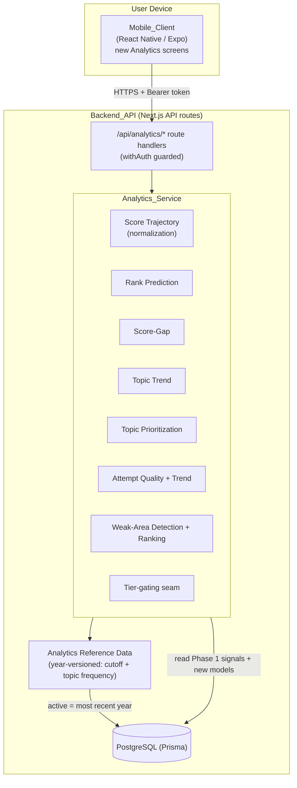

# Design Document

## Overview

Performance Analytics is the first Phase 2 capability cluster for the JEE/NEET Study Companion. It adds a new server-side component — the **Analytics_Service** — to the existing Backend_API and surfaces its outputs in the existing Mobile_Client. Phase 1 already *captured* the raw signals (PYQ attempts, timed-paper attempts with per-question outcomes and timing, a categorized mistake journal, and focus sessions tagged with a Session_Type). This spec *turns those signals into insight* across four capabilities:

1. **Score Trajectory & Rank Prediction** — combine user-entered external mock scores with app-derived PYQ/timed scores, normalize them onto a common percentage scale, plot the time series, estimate a JEE percentile band or NEET score range, and compute the improvement gap to a chosen target college cutoff.
2. **Topic-Wise NTA Trend Analysis** — surface year-versioned reference data of how often each topic appeared in the last ~10 years and the average questions per year.
3. **Attempt Quality Score** — a per-attempt measure (accuracy %, average time/question, unattempted count, attempt rate) tracked as a quality trend independent of content knowledge.
4. **Weak-Area Detection** — derive and rank weak Subjects/Chapters/Topics from PYQ attempts, timed-paper per-question outcomes, and mistake-journal entries, and feed the per-Topic weak-area score into topic prioritization.

This design follows the seams the Phase 1 design explicitly preserved in its *"Architectural Seams for Deferred Features"* table: *"a future read-only analytics service can aggregate without schema change"* and *"`PYQAttempt` / `TimedPaperAttempt` store full per-question outcomes and timing for later projection"*. Accordingly, the Analytics_Service:

- **Reads** persisted Phase 1 data (`PYQAttempt`, `TimedPaperAttempt`, `MistakeJournalEntry`, `FocusSession`) as its primary input, **never modifying** those records (Req 11.5, 13.1, 13.2).
- Adds only **additive** Prisma models and seeded reference catalogs, leaving every Phase 1 model and column unchanged (Req 13.3).
- Introduces two **year-versioned reference datasets** (cutoff data and topic-frequency data), modeled and seeded the same way Phase 1 modeled `Reference_Data` (a TypeScript catalog seeded into the database), and selecting the most-recent year as the active version (Req 5, 6).
- Keeps **every endpoint authenticated and per-user isolated** by reusing the Phase 1 `withAuth` guard and `assertOwnership` helper (Req 14).
- Adds all new user-facing strings to the existing EN/HI localized catalog with English fallback (Req 15).
- Defaults every output to the **Free tier** while leaving an explicit, centrally-defined **gating seam** so an output can later be designated Paid without touching call sites (Req 16).

### Scope boundaries

In scope: the four capabilities above plus their cutoff/topic-frequency reference data. Out of scope (other Phase 2 specs): AI Daily Briefing, formula vault/flashcards, mood/burnout tracking, push notifications, study-buddy/social, coaching-schedule integration, and the JoSAA step-by-step counseling walkthrough (only the cutoff *data* used by rank prediction is in scope, not a counseling guide).

## Architecture

### Placement within the existing system

The Analytics_Service is a new logical component **inside the existing Backend_API** (Next.js API routes + Prisma). It introduces no new deployable, no worker, and no external service. It reuses the Phase 1 building blocks unchanged: the `withAuth` session guard and `assertOwnership` (`lib/auth`), the error envelope and `ErrorCode` registry (`lib/errors`), the pure scoring outcome model (`lib/scoring`), the localization resolver/catalog (`lib/localization`), and the seeded-catalog → database reference-data pattern (`lib/reference` + `prisma/seed.ts`).



### Read-only-over-Phase-1 posture

The Analytics_Service treats Phase 1 user data as an **immutable input**. Every analytics output is a *pure derivation* of:

- persisted Phase 1 rows owned by the requesting user (`PYQAttempt.perQuestion`, `TimedPaperAttempt.perQuestion` + `timeTakenSec`, `MistakeJournalEntry.category`, `FocusSession.sessionType` + `focusedDurationMin`), plus
- the user's own new additive rows (`ExternalMockScore`, `TargetCollegeCutoffSelection`), plus
- system-supplied year-versioned reference data (`CutoffReferenceData` + `ScoreStandingMap`, `TopicFrequencyReferenceData`).

No analytics path issues an `UPDATE`/`DELETE` against any Phase 1 model. This is enforced structurally: the pure computation modules are database-free and receive already-read rows, so they *cannot* write, and the thin service handlers only ever `findMany`/`findUnique` on Phase 1 tables.

### Thin-route / pure-core layering (Phase 1 convention)

Every endpoint follows the established Phase 1 shape seen in the dashboard and audit services:

1. **Route file** (`app/api/analytics/.../route.ts`) — exports `withAuth((req, ctx) => handler(req, ctx))`. No business logic.
2. **Service handler** (`services/analytics/<area>Service.ts`) — loads the user's rows via Prisma scoped by `ctx.user.id`, asserts ownership of any referenced resource, selects the active reference-data version, then delegates all math to pure modules and serializes the result.
3. **Pure modules** (`services/analytics/<area>.ts`) — framework- and database-free functions that take plain rows and return plain results. These are the property-test surface, exactly as `dashboardAggregation.ts`, `velocity.ts`, and `lib/scoring/score.ts` are in Phase 1.

### Reference-data versioning approach

Phase 1 authored reference data as a TypeScript catalog (`lib/reference/catalog.ts`) and seeded it via `prisma/seed.ts`. Phase 2 reference data is **larger and must be re-versioned yearly**, so it is persisted in dedicated additive tables keyed by `(examTrack, referenceDataYear)` and seeded from new TypeScript catalogs (`lib/analytics/cutoffCatalog.ts`, `lib/analytics/topicFrequencyCatalog.ts`). The rules:

- **Active version** = the **maximum `referenceDataYear`** present for the requested `examTrack` (Req 5.2, 6.3). A single helper resolves the active year for a (track, datasetType) and is shared by every reader.
- **Loading a new year is additive**: a new year's rows are inserted; prior years' rows are retained (Req 5.3, 6.4). Seeding upserts by the natural key so re-seeding is idempotent.
- **Missing data** for a user's track yields a `REFERENCE_DATA_UNAVAILABLE` response for any output that requires it (Req 5.4).

### Topic granularity and question→topic mapping

The glossary defines **Topic** as the finest sub-unit of a Chapter, and states that *where Phase 1 records only at Chapter granularity, the Chapter SHALL serve as the Topic*. Phase 1 stores `subjectId` on `PYQ`, `MistakeJournalEntry`, and `FocusSession`, but does **not** link a question to a chapter/topic. To derive Chapter/Topic-level weak areas and to join topic-frequency records to user performance, this spec adds an **additive** `QuestionTopicMap` model (`questionId → topicKey`, where `topicKey` is a Phase 1 chapter `referenceKey`). This leaves the Phase 1 `PYQ` model unchanged (Req 13.3).

Granularity degradation is explicit and total: Subject-level weak areas are always derivable (every input row carries `subjectId`); Chapter/Topic-level weak areas are derivable for questions that have a `QuestionTopicMap` entry, and a question without a mapping contributes only at the Subject level. Topic == Chapter `referenceKey` throughout.

### Authentication & per-user isolation posture

Identical to Phase 1: every `/api/analytics/*` route is wrapped in `withAuth`, so a request without a valid session token is rejected `401 UNAUTHORIZED` before the handler runs (Req 14.1). Handlers scope every query by `ctx.user.id` (Req 14.2) and call `assertOwnership(resource.userId, ctx.user.id)` before reading any referenced `ExternalMockScore`, `TargetCollegeCutoffSelection`, `PYQAttempt`, or `TimedPaperAttempt`, yielding `403 FORBIDDEN` on a cross-user reference (Req 14.3).

### Monetization gating seam

A single module `services/analytics/tierGate.ts` exports a registry `PAID_ANALYTICS_OUTPUTS: Set<AnalyticsOutput>` (empty by default) and a guard `assertTierAllowed(output, tier)`. Each handler calls the guard immediately after auth. While the registry is empty, every output is granted to every tier (Req 16.1, 16.3). Designating an output Paid is a one-line registry edit; the guard then returns `402 UPGRADE_REQUIRED` for `FREE`-tier users requesting that output (Req 16.2), mirroring the Phase 1 AI-notes paywall.

## Components and Interfaces

All endpoints are prefixed `/api`, return JSON, require `Authorization: Bearer <token>`, and are scoped to the authenticated user. Request/response shapes are indicative. New endpoints live under `/analytics`.

### 1. External Mock Score endpoints (Req 1)

Responsibilities: validate and persist user-entered external mock scores; edit/delete; per-user isolation. Validation is a pure module (`mockScoreValidation.ts`); persistence is a thin handler.

| Method | Path | Request | Response |
|---|---|---|---|
| POST | `/analytics/mock-scores` | `{ source, sourceName?, testDate, obtainedScore, maxScore }` | `201 { mockScore }` / `422 VALIDATION_ERROR` |
| GET | `/analytics/mock-scores` | — | `200 { mockScores[] }` |
| PATCH | `/analytics/mock-scores/:id` | `{ source?, sourceName?, testDate?, obtainedScore?, maxScore? }` | `200 { mockScore }` / `403` / `404` / `422` |
| DELETE | `/analytics/mock-scores/:id` | — | `204` / `403` / `404` |

Validation rules (Req 1.2–1.4): `maxScore > 0`; `0 ≤ obtainedScore ≤ maxScore`; `testDate ≤ now`. `source ∈ {ALLEN, AAKASH, OTHER}`; when `source = OTHER`, `sourceName` is a required non-blank label. Edits re-run the same validation against the merged record (Req 1.5). `:id` is ownership-checked (Req 14.3).

### 2. Score Trajectory endpoint (Req 2)

Responsibilities: assemble a normalized, time-ordered series from the user's external mock scores plus app-derived PYQ/timed scores; optional date-range filter.

| Method | Path | Request | Response |
|---|---|---|---|
| GET | `/analytics/score-trajectory?from=&to=` | — | `200 { points: ScoreDataPoint[] }` |

`ScoreDataPoint = { date, source: 'EXTERNAL_MOCK'|'PYQ_ATTEMPT'|'TIMED_PAPER_ATTEMPT', normalizedPercent, obtained, max }`. Points are sorted ascending by date. `normalizedPercent = obtained / max * 100` (Req 2.2). For an `ExternalMockScore`, `obtained/max` are the entered scores; for an attempt, `obtained = totalScore` and `max = perQuestion.length` (the number of scored questions). `from`/`to` (inclusive ISO dates) filter by point date (Req 2.4). With no source data the series is `[]` (Req 2.5).

### 3. Rank Prediction endpoint (Req 3)

Responsibilities: map the user's recent normalized score points to a JEE percentile band or NEET score range using the active `ScoreStandingMap` for the user's Exam_Track; always return a range; surface insufficient-data and reference-unavailable states.

| Method | Path | Request | Response |
|---|---|---|---|
| GET | `/analytics/rank-prediction` | — | `200 RankPredictionResult` / `503 REFERENCE_DATA_UNAVAILABLE` |

`RankPredictionResult` is a discriminated union:
- `{ kind: 'OK', track, estimate: { low, high, unit }, referenceDataYear }` — `unit = 'PERCENTILE'` for JEE (`JEE_Percentile_Estimate`), `unit = 'MARKS'` for NEET (`NEET_Score_Range_Estimate`); always a band, never a single value (Req 3.1, 3.2, 3.3, 3.5).
- `{ kind: 'INSUFFICIENT_DATA', minimumRequired: MIN_SCORE_POINTS }` — fewer than the minimum recent points (Req 3.4).

The Exam_Track is read from the user's `Profile`. "Recent points" = the most recent `RECENT_POINTS_WINDOW` score-trajectory points (a representative central tendency of those points is mapped through the standing map's bands). `MIN_SCORE_POINTS` and `RECENT_POINTS_WINDOW` are module constants.

### 4. Target Cutoff selection & Score-Gap endpoints (Req 4, 5)

Responsibilities: list selectable cutoff entries from the active dataset; persist a per-user `Target_College_Cutoff` selection; compute the improvement gap.

| Method | Path | Request | Response |
|---|---|---|---|
| GET | `/analytics/cutoffs` | — | `200 { referenceDataYear, cutoffs: CutoffEntry[] }` / `503` |
| GET | `/analytics/target-cutoff` | — | `200 { selection \| null }` |
| PUT | `/analytics/target-cutoff` | `{ cutoffReferenceId }` | `200 { selection }` / `403` / `404` |
| GET | `/analytics/score-gap` | — | `200 ScoreGapResult` / `422 TARGET_CUTOFF_REQUIRED` / `503` |

`CutoffEntry = { id, collegeName, branchName, category, closingValue, unit: 'RANK'|'PERCENTILE'|'MARKS' }`, drawn from the active `CutoffReferenceData` for the user's track (Req 4.1, 5.1, 5.2). `PUT /analytics/target-cutoff` validates that `cutoffReferenceId` belongs to the active dataset for the user's track and upserts the user's single selection (Req 4.1). `ScoreGapResult`:
- `{ kind: 'GAP', gap, unit, referenceDataYear }` — positive distance from current `Rank_Prediction` to the target standing, in the cutoff's units (Req 4.2, 4.5).
- `{ kind: 'MET', margin, unit, referenceDataYear }` — current prediction meets/exceeds the cutoff; `margin` is the amount by which it is exceeded (Req 4.3).
- `{ kind: 'INSUFFICIENT_DATA', minimumRequired }` — propagated when the underlying rank prediction lacks data.

Requesting the gap with no selection returns `422 TARGET_CUTOFF_REQUIRED` (Req 4.4).

### 5. Topic Trend endpoint (Req 6, 7)

Responsibilities: return every Topic for the user's track with its appearance count and average questions/year from the active `TopicFrequencyReferenceData`, descending by average questions/year, zero-filling topics with no record.

| Method | Path | Request | Response |
|---|---|---|---|
| GET | `/analytics/topic-trends` | — | `200 { referenceDataYear, topics: TopicTrend[] }` / `503` |

`TopicTrend = { topicKey, topicName, subjectName, appearanceCount, yearSpan, avgQuestionsPerYear, hasFrequencyData }`. The Topic universe is the user's track chapter catalog (`lib/reference`); a topic absent from the active frequency dataset is included with `appearanceCount = 0`, `avgQuestionsPerYear = 0`, `hasFrequencyData = false` (Req 7.3). Ordering is descending by `avgQuestionsPerYear` (Req 7.2).

### 6. Topic Prioritization endpoint (Req 8, 12)

Responsibilities: combine each Topic's average questions/year with the user's per-Topic `Weak_Area_Score` into a `Topic_Priority`, descending by priority, flagging combined high-frequency-and-weak topics.

| Method | Path | Request | Response |
|---|---|---|---|
| GET | `/analytics/topic-priority` | — | `200 { referenceDataYear, topics: TopicPriority[] }` / `503` |

`TopicPriority = { topicKey, topicName, avgQuestionsPerYear, weakAreaScore, priority, isHighFreqAndWeak }`. `priority` combines normalized frequency and normalized weak-area score (see Algorithms). A topic above the dataset's high-frequency threshold *and* present among the user's ranked weak areas is flagged `isHighFreqAndWeak = true` (Req 8.3). With no weak areas, priority derives from frequency alone (Req 8.4). Ordered descending by `priority` (Req 8.2).

### 7. Attempt Quality endpoint (Req 9)

Responsibilities: compute one attempt's quality metrics from its persisted per-question outcomes, without modifying the attempt.

| Method | Path | Request | Response |
|---|---|---|---|
| GET | `/analytics/attempts/:attemptId/quality?type=PYQ\|TIMED` | — | `200 AttemptQuality` / `403` / `404` |

`AttemptQuality = { accuracyPercent, averageTimePerQuestion: number\|null, unattemptedCount, attemptRate }`. The attempt is loaded by `(type, attemptId)`, ownership-checked (Req 14.3), and passed to the pure `computeAttemptQuality`. `averageTimePerQuestion` is `null` (unavailable) for a PYQ attempt, which records no time (Req 9.4); for a timed attempt it is `timeTakenSec / questionCount`. Computation reads only persisted outcomes and writes nothing (Req 9.5).

### 8. Attempt Quality Trend endpoint (Req 10)

Responsibilities: return a time-ordered series of quality metrics across the user's attempts, the direction of change for accuracy and attempt rate, optional subject filter, separate from content-knowledge metrics.

| Method | Path | Request | Response |
|---|---|---|---|
| GET | `/analytics/attempt-quality-trend?subjectId=&from=&to=` | — | `200 AttemptQualityTrendResult` |

`AttemptQualityTrendResult`:
- `{ kind: 'OK', series: AttemptQualityPoint[], accuracyDirection, attemptRateDirection }` where each direction ∈ `{ 'INCREASED', 'DECREASED', 'UNCHANGED' }` computed between the earliest and latest attempts in range (Req 10.3); `AttemptQualityPoint = { date, accuracyPercent, averageTimePerQuestion: number\|null, attemptRate }`.
- `{ kind: 'INSUFFICIENT_DATA', minimumRequired: 2 }` when fewer than two attempts fall in range (Req 10.5).

`subjectId` filters to attempts belonging to that Subject, computing each attempt's metrics over that subject's questions (a question's subject is `PYQ.subjectId`); see Algorithms (Req 10.4). This trend is a distinct endpoint and payload from the Score Trajectory, satisfying the "reported separately" requirement (Req 10.2).

### 9. Weak-Area endpoint (Req 11, 12)

Responsibilities: derive weak Subjects/Chapters/Topics from PYQ attempts, timed-paper outcomes, and mistake-journal entries; include per-Mistake_Category counts and per-Session_Type study-time distribution; assign and rank by `Weak_Area_Score`; expose per-Topic scores for prioritization.

| Method | Path | Request | Response |
|---|---|---|---|
| GET | `/analytics/weak-areas` | — | `200 WeakAreaResult` |

`WeakAreaResult = { weakAreas: WeakArea[], sessionTypeDistribution: { sessionType, totalMinutes }[] }`. `WeakArea = { level: 'SUBJECT'|'CHAPTER'|'TOPIC', key, name, weakAreaScore, incorrectCount, attemptedCount, mistakeCounts: Record<MistakeCategory, number> }`. Weak areas are ordered descending by `weakAreaScore`, breaking ties by `incorrectCount` descending (Req 12.1, 12.3). A Subject/Chapter/Topic with no PYQ outcomes, no timed outcomes, and no mistake entries is excluded (Req 11.4). The per-Topic `weakAreaScore` map is the shared input to topic prioritization (Req 12.2). The `sessionTypeDistribution` surfaces the Phase 1 `Session_Type` data (Req 11.3).

### 10. Reference Data (seeded, additive)

Responsibilities: system-supplied year-versioned cutoff and topic-frequency datasets, authored as TypeScript catalogs and seeded into additive tables via an extension of `prisma/seed.ts`. No user-facing write endpoint; updates ship via seed (consistent with Phase 1 reference data). The active-version resolver (`lib/analytics/referenceVersion.ts`) returns the max `referenceDataYear` for a `(track, datasetType)`.

### 11. Localization additions (Req 15)

All new labels/messages (source names, axis labels, insufficient-data and reference-unavailable messages, mistake-category and session-type labels reused from Phase 1 where present, priority/weak-area labels) are added to `lib/localization/catalog.ts` under an `analytics.*` namespace with `en` and `hi` values (Req 15.3). The Mobile_Client renders via the existing `resolveString`/`createResolver`, honoring the stored `Language_Preference` and falling back to English for any missing key (Req 15.1, 15.2). Stable `ErrorCode` strings continue to map to localized client messages.

## Data Models

All new models are **additive**; no existing Phase 1 enum, model, or column is altered (Req 13.3). Every model carries `id` (uuid), `createdAt`, and `updatedAt`, per the Phase 1 convention. User-owned models carry `userId` for per-user isolation and cascade-delete with the `User`.

### New enums

```prisma
enum MockSeriesSource {
  ALLEN
  AAKASH
  OTHER
}

enum CutoffUnit {
  RANK        // JoSAA closing rank (JEE)
  PERCENTILE  // JEE Main percentile
  MARKS       // NEET marks / score
}

enum ReferenceDatasetType {
  CUTOFF
  SCORE_STANDING_MAP
  TOPIC_FREQUENCY
}
```

### User-owned additive models

```prisma
// External_Mock_Score (Req 1). Validation (obtained in [0,max], max>0, testDate<=now)
// is enforced in the service layer before persistence.
model ExternalMockScore {
  id            String           @id @default(uuid())
  userId        String
  source        MockSeriesSource
  sourceName    String?          // required (non-blank) only when source = OTHER
  testDate      DateTime         // must be <= now at write time (Req 1.4)
  obtainedScore Float            // 0 <= obtainedScore <= maxScore (Req 1.2)
  maxScore      Float            // > 0 (Req 1.3)
  createdAt     DateTime         @default(now())
  updatedAt     DateTime         @updatedAt

  user User @relation(fields: [userId], references: [id], onDelete: Cascade)

  @@index([userId])
  @@index([userId, testDate])
}

// Target_College_Cutoff selection (Req 4.1). One active selection per user; the
// referenced cutoff row must belong to the active dataset for the user's track.
model TargetCollegeCutoffSelection {
  id                String   @id @default(uuid())
  userId            String   @unique // a single current selection per user
  cutoffReferenceId String
  createdAt         DateTime @default(now())
  updatedAt         DateTime @updatedAt

  user            User                @relation(fields: [userId], references: [id], onDelete: Cascade)
  cutoffReference CutoffReferenceData @relation(fields: [cutoffReferenceId], references: [id])

  @@index([userId])
}

// Additive question -> topic (chapter referenceKey) mapping enabling Chapter/Topic-level
// weak-area detection without altering the Phase 1 PYQ model (Req 13.3). Absent mapping =>
// the question contributes only at Subject level.
model QuestionTopicMap {
  id         String    @id @default(uuid())
  questionId String    @unique // PYQ.id
  examTrack  ExamTrack
  subjectId  String
  topicKey   String    // Phase 1 Chapter.referenceKey == Topic key
  createdAt  DateTime  @default(now())
  updatedAt  DateTime  @updatedAt

  @@index([topicKey])
  @@index([subjectId])
}
```

### System-supplied year-versioned reference models

```prisma
// Cutoff_Reference_Data (Req 5): JoSAA (JEE) / NEET counseling closing data, keyed by
// Exam_Track and labeled with Reference_Data_Year. Additive years are inserted; prior
// years retained (Req 5.3). Active version = max(referenceDataYear) for the track (Req 5.2).
model CutoffReferenceData {
  id                String     @id @default(uuid())
  examTrack         ExamTrack
  referenceDataYear Int
  collegeName       String
  branchName        String
  category          String     // e.g. General/OBC/SC/ST/EWS
  closingValue      Float      // interpreted per `unit`
  unit              CutoffUnit
  createdAt         DateTime   @default(now())
  updatedAt         DateTime   @updatedAt

  selections TargetCollegeCutoffSelection[]

  @@unique([examTrack, referenceDataYear, collegeName, branchName, category])
  @@index([examTrack, referenceDataYear])
}

// Score-to-standing mapping used by Rank_Prediction, versioned alongside the cutoff
// dataset (Req 3.1/3.2 "the percentile mapping defined in the active Cutoff_Reference_Data").
// Each row is one band: a normalized-score% range mapped to an estimated standing band.
model ScoreStandingMap {
  id                String     @id @default(uuid())
  examTrack         ExamTrack
  referenceDataYear Int
  minScorePercent   Float      // inclusive lower bound of the normalized score % band
  maxScorePercent   Float      // inclusive upper bound
  estimateLow       Float      // low end of the estimated standing band
  estimateHigh      Float      // high end of the estimated standing band
  unit              CutoffUnit // PERCENTILE (JEE) or MARKS (NEET)
  createdAt         DateTime   @default(now())
  updatedAt         DateTime   @updatedAt

  @@unique([examTrack, referenceDataYear, minScorePercent, maxScorePercent])
  @@index([examTrack, referenceDataYear])
}

// Topic_Frequency_Reference_Data (Req 6): per-Topic appearance count, covered year span,
// and average questions/year, keyed by Exam_Track and Reference_Data_Year. `topicKey`
// matches a Phase 1 Chapter.referenceKey so frequency joins to user weak areas by topic.
model TopicFrequencyReferenceData {
  id                 String    @id @default(uuid())
  examTrack          ExamTrack
  referenceDataYear  Int
  topicKey           String    // == Chapter.referenceKey (Req 6.1)
  topicName          String
  subjectKey         String
  appearanceCount    Int       // appearances across the covered span (Req 6.2)
  yearSpanStart      Int       // first covered exam year (Req 6.2)
  yearSpanEnd        Int       // last covered exam year (Req 6.2)
  avgQuestionsPerYear Float    // average questions per year (Req 6.2)
  createdAt          DateTime  @default(now())
  updatedAt          DateTime  @updatedAt

  @@unique([examTrack, referenceDataYear, topicKey])
  @@index([examTrack, referenceDataYear])
}
```

### Phase 1 data read by the Analytics_Service (unchanged)

The Analytics_Service reads, but never writes, these Phase 1 models (Req 13.1, 13.2):

- **`PYQAttempt`** — `perQuestion: [{ questionId, outcome }]`, `totalScore`, `createdAt`; questions joined to `PYQ.subjectId` and (via `QuestionTopicMap`) to `topicKey`.
- **`TimedPaperAttempt`** — `perQuestion`, `totalScore`, `timeTakenSec`, `paperId`, `createdAt`.
- **`MistakeJournalEntry`** — `category`, `subjectId`, `questionId`, `createdAt`.
- **`FocusSession`** — `sessionType`, `subjectId`, `focusedDurationMin`, `startTime`.
- **`Profile`** — `examTrack` (selects active reference dataset and rank-prediction mode), `subscriptionTier` (gating seam), `language` (localization).

### Relationship summary

`User 1—* ExternalMockScore`; `User 1—1 TargetCollegeCutoffSelection`; `TargetCollegeCutoffSelection *—1 CutoffReferenceData`. `CutoffReferenceData`, `ScoreStandingMap`, and `TopicFrequencyReferenceData` are global, system-supplied, and filtered by `(examTrack, referenceDataYear)` at read time. `QuestionTopicMap` is global reference mapping joined to `PYQ` by `questionId`. No relation crosses into a Phase 1 model in a way that adds a column to it; `QuestionTopicMap` references `PYQ.id` by value (no FK back-reference added to `PYQ`), keeping `PYQ` untouched.

## Algorithms / Key Logic

### Score-Data-Point normalization & trajectory assembly (Req 2)

For each source row, build a `ScoreDataPoint`:
- `ExternalMockScore` → `{ date: testDate, source: 'EXTERNAL_MOCK', obtained: obtainedScore, max: maxScore }`.
- `PYQAttempt` → `{ date: createdAt, source: 'PYQ_ATTEMPT', obtained: totalScore, max: perQuestion.length }`.
- `TimedPaperAttempt` → `{ date: createdAt, source: 'TIMED_PAPER_ATTEMPT', obtained: totalScore, max: perQuestion.length }`.

`normalizedPercent = max > 0 ? obtained / max * 100 : 0`. Concatenate all points, optionally filter by `[from, to]` (inclusive), sort ascending by date. Empty inputs → `[]`. Pure function of `(mockScores, pyqAttempts, timedAttempts, range)`.

### Rank prediction (Req 3)

1. Take the most recent `RECENT_POINTS_WINDOW` normalized points (by date). If the count `< MIN_SCORE_POINTS`, return `INSUFFICIENT_DATA` with `minimumRequired = MIN_SCORE_POINTS`.
2. Compute a representative recent score % (the mean of the windowed points).
3. Load the active `ScoreStandingMap` for the track (max year). If none, the handler returns `REFERENCE_DATA_UNAVAILABLE`.
4. Find the band whose `[minScorePercent, maxScorePercent]` contains the representative %, and return `{ low: estimateLow, high: estimateHigh, unit }` with the dataset's `referenceDataYear`. Out-of-range values clamp to the nearest band. The result is always a band (`low ≤ high`), never a single value (Req 3.3).

JEE tracks use `unit = PERCENTILE`; NEET tracks use `unit = MARKS` — selected from the `Profile.examTrack` and reflected in the seeded map rows.

### Score-improvement gap (Req 4)

Given the user's `TargetCollegeCutoffSelection` → `CutoffReferenceData` row `(closingValue, unit)` and the current `RankPredictionResult`:
- If prediction is `INSUFFICIENT_DATA`, propagate it.
- Compare in the cutoff's `unit`. The "standing" is directional per unit: for `PERCENTILE`/`MARKS`, higher is better; for `RANK`, lower is better. Using the prediction band's best-comparable bound:
  - **Met** when the user's standing meets/exceeds the cutoff (e.g., predicted percentile ≥ closing percentile, or predicted rank ≤ closing rank): return `{ kind: 'MET', margin = |userStanding − closingValue| }`.
  - **Gap** otherwise: `{ kind: 'GAP', gap = |closingValue − userStanding| }`.
- Always include the cutoff dataset's `referenceDataYear` (Req 4.5). No selection → `TARGET_CUTOFF_REQUIRED` (Req 4.4).

### Topic trend ordering & zero-fill (Req 7)

Start from the user's track topic universe (chapter catalog). Left-join the active `TopicFrequencyReferenceData` by `topicKey`. Topics with a record carry their `appearanceCount`, `yearSpan`, `avgQuestionsPerYear`, `hasFrequencyData = true`; topics without a record are zero-filled with `hasFrequencyData = false` (Req 7.3). Sort descending by `avgQuestionsPerYear` (stable tiebreak by `topicName`) (Req 7.2).

### Topic prioritization (Req 8)

For each topic, `priority = wFreq * norm(avgQuestionsPerYear) + wWeak * norm(weakAreaScore)`, where `norm` scales each component to `[0,1]` over the current topic set and `wFreq, wWeak` are fixed weights. When the user has no weak areas, `weakAreaScore = 0` for all topics, so priority reduces to the normalized frequency term alone (Req 8.4). A topic is flagged `isHighFreqAndWeak` when its `avgQuestionsPerYear ≥ HIGH_FREQUENCY_THRESHOLD` (a dataset-level threshold) *and* it appears among the user's ranked weak areas (Req 8.3). Sort descending by `priority` (Req 8.2). Pure function of `(topicFrequencies, weakAreaScoreByTopic)`.

### Attempt quality (Req 9)

From an attempt's `perQuestion` outcomes (and optional `timeTakenSec`):
- `total = perQuestion.length`; `unattemptedCount = count(UNANSWERED)`; `attemptedCount = total − unattemptedCount`; `correct = count(CORRECT)`.
- `accuracyPercent = attemptedCount > 0 ? correct / attemptedCount * 100 : 0` (Req 9.2, 9.3).
- `attemptRate = total > 0 ? attemptedCount / total * 100 : 0`.
- `averageTimePerQuestion = timeTakenSec != null && total > 0 ? timeTakenSec / total : null` — `null` for PYQ attempts, which carry no time (Req 9.4).

Pure function; reads outcomes only, never mutates (Req 9.5).

### Attempt quality trend & direction (Req 10)

Map each in-range attempt to an `AttemptQualityPoint` via `computeAttemptQuality`, sorted ascending by date. If `< 2` points, return `INSUFFICIENT_DATA` (`minimumRequired = 2`, Req 10.5). Otherwise compute direction for accuracy and attempt rate by comparing the latest to the earliest point: `INCREASED` if later > earlier, `DECREASED` if later < earlier, else `UNCHANGED` (Req 10.3). The `subjectId` filter restricts to questions whose `PYQ.subjectId` equals the selected subject, recomputing each attempt's metrics over only that subject's questions, and dropping attempts that then have zero questions for the subject (Req 10.4). This is computed and returned independently of the Score Trajectory endpoint (Req 10.2).

### Weak-area detection, scoring & ranking (Req 11, 12)

1. **Gather per-question outcomes** from the user's `PYQAttempt.perQuestion` and `TimedPaperAttempt.perQuestion`. Resolve each `questionId` to its `subjectId` (via `PYQ`) and `topicKey` (via `QuestionTopicMap`, when present).
2. **Aggregate** at three levels (Subject, Chapter/Topic) the `attemptedCount`, `incorrectCount`, and `correct`. Topic/Chapter buckets are only formed for questions with a `topicKey`.
3. **Fold in mistakes**: per bucket, count `MistakeJournalEntry` rows per `Mistake_Category` (Req 11.2).
4. **Exclude empty buckets**: any Subject/Chapter/Topic with no attempt outcomes *and* no mistake entries is dropped (Req 11.4).
5. **Score**: `weakAreaScore = wErr * errorRate + wMiss * normalizedMistakeWeight`, where `errorRate = incorrectCount / max(attemptedCount, 1)` and `normalizedMistakeWeight` is a weighted sum of category counts (e.g., Concept Gap and Never Seen This weigh higher than Silly Mistake). Higher score = more attention needed.
6. **Rank** descending by `weakAreaScore`, tie-broken by `incorrectCount` descending (Req 12.1, 12.3).
7. **Expose** the per-Topic `weakAreaScore` map for topic prioritization (Req 12.2).
8. **Session-type distribution**: sum `FocusSession.focusedDurationMin` grouped by `sessionType` and include it in the output (Req 11.3).

All steps are pure over already-read rows; no Phase 1 row is modified (Req 11.5).

## Correctness Properties

*A property is a characteristic or behavior that should hold true across all valid executions of a system — essentially, a formal statement about what the system should do. Properties serve as the bridge between human-readable specifications and machine-verifiable correctness guarantees.*

The Analytics_Service is overwhelmingly **pure computation** (normalization, mapping, aggregation, scoring, ranking, filtering) over already-read rows, which is the ideal surface for property-based testing. Each property below is universally quantified and intended for property-based testing (minimum 100 generated iterations), implemented with **fast-check** consistent with the Phase 1 `*.property.test.ts` pattern. Cross-cutting concerns that do not vary meaningfully with input (auth guard wiring, reference-data seeding/retention, active-year reflected in a response, schema additivity, catalog completeness) are covered by integration/example/smoke tests in the Testing Strategy instead. The properties below were consolidated during prework reflection to remove redundancy.

### Property 1: External mock score validation boundaries
*For any* candidate external mock score `(obtainedScore, maxScore, testDate)`, validation accepts it if and only if `maxScore > 0` and `0 ≤ obtainedScore ≤ maxScore` and `testDate ≤ now` (and, when `source = OTHER`, `sourceName` is non-blank); any input violating a bound is rejected with a validation error.
**Validates: Requirements 1.2, 1.3, 1.4**

### Property 2: External mock score persistence round-trip
*For any* valid external mock score, persisting it and reading it back yields a record equal to the submitted values associated with the submitting user; and *for any* subsequent valid edit, reading back yields the merged validated values, while a delete makes the record absent.
**Validates: Requirements 1.1, 1.5**

### Property 3: Score trajectory assembly, normalization, labeling, and filtering
*For any* set of external mock scores, PYQ attempts, and timed-paper attempts (and any optional date range), the assembled trajectory contains exactly one point per source row whose date falls in range, each point is labeled with its originating source, each point's `normalizedPercent` equals `obtained / max * 100` (and `0` when `max = 0`), the points are ordered ascending by date, and the trajectory is empty when there are no source rows.
**Validates: Requirements 2.1, 2.2, 2.3, 2.4, 2.5**

### Property 4: Rank prediction maps recent points to a standing band
*For any* user track and active score-standing map with at least the minimum recent score points, the rank prediction returns a band `{ low, high, unit }` where `low ≤ high`, `unit = PERCENTILE` for the JEE track and `unit = MARKS` for the NEET track, and the band is the one whose score range contains the representative recent score (clamped to the nearest band when out of range).
**Validates: Requirements 3.1, 3.2, 3.3**

### Property 5: Rank prediction insufficient-data threshold
*For any* number of available recent score points, the rank prediction returns an insufficient-data response identifying the minimum required if and only if the count is below that minimum, and an estimate otherwise.
**Validates: Requirements 3.4**

### Property 6: Target cutoff selection round-trip
*For any* cutoff entry in the active dataset for the user's track, selecting it persists a single current selection for that user such that reading the selection back returns the same cutoff reference.
**Validates: Requirements 4.1**

### Property 7: Score-improvement gap and met-margin
*For any* rank prediction and selected target cutoff, when the user's standing meets or exceeds the cutoff the result is `MET` with `margin` equal to the absolute amount the cutoff is exceeded by, otherwise the result is `GAP` with `gap` equal to the absolute difference between the user's standing and the cutoff, with the comparison and magnitude expressed in the cutoff's units (lower-is-better for RANK, higher-is-better for PERCENTILE/MARKS).
**Validates: Requirements 4.2, 4.3**

### Property 8: Active reference-data version selection
*For any* non-empty set of available reference-data years for a track and dataset type, the active-version resolver selects the maximum (most recent) year.
**Validates: Requirements 5.2, 6.3**

### Property 9: Topic trend projection, zero-fill, and ordering
*For any* topic universe and active topic-frequency dataset, the topic trend includes every topic in the universe, projects `appearanceCount` and `avgQuestionsPerYear` from the matching frequency record when present, zero-fills (`appearanceCount = 0`, `avgQuestionsPerYear = 0`, `hasFrequencyData = false`) any topic without a record, and orders the result non-increasing by `avgQuestionsPerYear`.
**Validates: Requirements 7.1, 7.2, 7.3**

### Property 10: Topic prioritization combination, ordering, flag, and no-weak-areas fallback
*For any* topic frequencies and per-topic weak-area scores, each topic's `priority` equals the defined combination of its normalized average questions/year and its normalized weak-area score, topics are ordered non-increasing by `priority`, a topic is flagged high-frequency-and-weak if and only if its average questions/year is at or above the high-frequency threshold and it appears among the user's weak areas, and when there are no weak areas the ordering equals the ordering by frequency alone.
**Validates: Requirements 8.1, 8.2, 8.3, 8.4**

### Property 11: Attempt quality metrics
*For any* attempt with persisted per-question outcomes and an optional time taken, the computed accuracy equals `correct / attempted * 100` (and `0` when there are no attempted questions), the unattempted count equals the number of unanswered questions, the attempt rate equals `attempted / total * 100`, and the average time per question equals `timeTaken / total` when a time is present and is reported as unavailable (`null`) when no time is recorded.
**Validates: Requirements 9.1, 9.2, 9.3, 9.4**

### Property 12: Analytics computation does not mutate Phase 1 inputs
*For any* set of input attempt, mistake, and focus-session rows, computing attempt quality and weak areas leaves every input row deep-equal to its pre-computation value (no field is altered).
**Validates: Requirements 9.5, 11.5, 13.2**

### Property 13: Attempt quality trend series, direction, subject filter, and insufficient-data
*For any* set of in-range attempts, the trend returns a date-ascending series of per-attempt quality metrics, reports the direction of change of accuracy and of attempt rate between the earliest and latest attempts as increased/decreased/unchanged matching the sign of (latest − earliest), restricts to the selected subject's questions when a subject filter is supplied, and returns an insufficient-data response (minimum two) if and only if fewer than two attempts fall in range.
**Validates: Requirements 10.1, 10.3, 10.4, 10.5**

### Property 14: Weak-area derivation, category counts, and exclusion
*For any* set of per-question outcomes and mistake-journal entries, the derived weak areas at each level (Subject, Chapter, Topic) aggregate the attempted/incorrect counts and the per-Mistake_Category counts of their constituent inputs, and a Subject/Chapter/Topic is included if and only if it has at least one attempt outcome or at least one mistake entry.
**Validates: Requirements 11.1, 11.2, 11.4**

### Property 15: Session-type study-time distribution
*For any* set of focus sessions, the session-type distribution reports, for each session type, the exact sum of focused minutes of that type's sessions, conserving total minutes with no double counting.
**Validates: Requirements 11.3**

### Property 16: Weak-area ranking and tiebreak
*For any* derived set of weak areas, the result is ordered non-increasing by `weakAreaScore`, and any two areas with equal scores are ordered by incorrect count descending.
**Validates: Requirements 12.1, 12.3**

### Property 17: Per-user isolation of analytics outputs
*For any* two users' datasets, every analytics output computed for one user is identical whether or not the other user's rows are present — i.e. an output depends only on the requesting user's data.
**Validates: Requirements 14.2**

### Property 18: Localized analytics strings fall back to English
*For any* analytics string key that lacks a Hindi value, resolving it under the Hindi preference returns the English value for that key.
**Validates: Requirements 15.2**

### Property 19: Tier-gating decision
*For any* analytics output and subscription tier, the tier gate grants access when the output is not in the paid-output registry (so all outputs are granted while the registry is empty), and rejects a Free-tier request with an upgrade-required result if and only if the output is designated paid; Paid-tier requests are always granted.
**Validates: Requirements 16.1, 16.2, 16.3**

## Error Handling

The Analytics_Service reuses the Phase 1 error envelope `{ error: { code, message, details? } }` and the stable `ErrorCode` registry (`lib/errors`). It adds the following stable codes (additive to the existing registry; the Mobile_Client maps each to a localized message):

- `INSUFFICIENT_DATA` — returned *in a 200 discriminated payload*, not as an error envelope (see below).
- `REFERENCE_DATA_UNAVAILABLE` — HTTP `503`; no active reference dataset exists for the user's track.
- `TARGET_CUTOFF_REQUIRED` — HTTP `422`; a score-gap request was made with no selected target cutoff.

Existing codes are reused unchanged: `VALIDATION_ERROR` (422), `UPGRADE_REQUIRED` (402), `UNAUTHORIZED` (401), `FORBIDDEN` (403), `NOT_FOUND` (404).

### Validation errors (HTTP 422)
- External mock score: `maxScore ≤ 0`, `obtainedScore < 0` or `> maxScore`, `testDate` in the future, or `source = OTHER` with a blank `sourceName` → `422 VALIDATION_ERROR` with `details.field` naming the offending field (Req 1.2, 1.3, 1.4). All validation is server-side and pure; rejected requests persist nothing.
- Score-gap requested without a target-cutoff selection → `422 TARGET_CUTOFF_REQUIRED` (Req 4.4).

### Expected computational states (HTTP 200, discriminated payloads)
"Insufficient data" and "gap vs met" are normal, expected outcomes — not failures — so they are returned as `200` responses with a discriminated `kind` field, consistent with the Phase 1 velocity service returning `AHEAD`/`BEHIND` in its body:
- Rank prediction with too few recent points → `{ kind: 'INSUFFICIENT_DATA', minimumRequired }` (Req 3.4).
- Attempt quality trend with fewer than two in-range attempts → `{ kind: 'INSUFFICIENT_DATA', minimumRequired: 2 }` (Req 10.5).
- Score gap → `{ kind: 'GAP' | 'MET' | 'INSUFFICIENT_DATA', ... }` (Req 4.2, 4.3).

This keeps "no data yet" distinct from "request was malformed," so the client can render an empty/onboarding state rather than an error toast.

### Reference-data unavailable (HTTP 503)
Any output requiring reference data (rank prediction, score gap, cutoff list, topic trend, topic priority) returns `503 REFERENCE_DATA_UNAVAILABLE` when no active dataset exists for the user's track (Req 5.4). This is an operational gap (seed not loaded), distinct from the empty-but-valid computational states above.

### Auth & authorization errors (HTTP 401 / 403)
Identical to Phase 1, via `withAuth` and `assertOwnership`:
- Missing/invalid/expired session token on any `/api/analytics/*` route → `401 UNAUTHORIZED` before the handler runs (Req 14.1).
- A request referencing an `ExternalMockScore`, `TargetCollegeCutoffSelection`, `PYQAttempt`, or `TimedPaperAttempt` not owned by the requester → `403 FORBIDDEN`; ownership is asserted before any read or computation (Req 14.3).

### Monetization gating (HTTP 402)
While the paid-output registry is empty, no gate fires (Req 16.1, 16.3). When an output is designated paid, a Free-tier request for it returns `402 UPGRADE_REQUIRED` (Req 16.2), reusing the Phase 1 paywall code and the client's existing upgrade flow.

### Not found (HTTP 404)
A `:id`/`:attemptId` path param that resolves to no row (for the requesting user) returns `404 NOT_FOUND`. To avoid leaking cross-user existence, a row owned by another user is treated as `403` via `assertOwnership` only after the row is loaded; a non-existent id is `404`.

### Untrusted input
All numeric/date inputs are validated and coerced server-side before use; user-entered `sourceName` and any free text are stored as data and escaped on render (never interpolated into queries — Prisma parameterizes throughout), consistent with the Phase 1 security posture. Reference data is system-supplied via seed, not user-writable.

## Testing Strategy

A dual approach mirroring Phase 1: **property-based tests** for the pure analytics logic (the bulk of this feature), and **example/integration/smoke tests** for endpoint wiring, reference-data seeding/versioning, auth, and configuration. Property tests verify general correctness across the input space; example tests pin specific scenarios and integration wiring.

### Property-based tests
- Library: **fast-check** (TypeScript), matching the existing `*.property.test.ts` files. Each test file sits next to the pure module it validates under `services/analytics/` (and `lib/analytics/` for shared helpers).
- Each of Properties 1–19 is implemented by a **single** property-based test running a **minimum of 100 iterations** (the global fast-check config in `vitest.setup.ts`).
- Each test is tagged with a comment referencing its design property, in the Phase 1 format:
  `// Feature: performance-analytics, Property {number}: {property_text}`
- Generators model the domain: external mock scores (valid and boundary-violating `obtained`/`max`/`testDate`), PYQ/timed attempts as `perQuestion` outcome arrays (`CORRECT`/`INCORRECT`/`UNANSWERED`) with/without `timeTakenSec`, mistake-journal entries across the four `Mistake_Category` values, focus sessions across the five `Session_Type` values, topic-frequency datasets, score-standing maps (JEE percentile and NEET marks), cutoff entries across `RANK`/`PERCENTILE`/`MARKS` units, and multi-year reference sets for the active-version resolver. Deliberate edge cases from prework are included in generators: empty source sets (Req 2.5), all-unanswered attempts (Req 9.3), zero/one attempt counts (Req 10.5), point counts straddling the rank-prediction minimum (Req 3.4), topics missing frequency records (Req 7.3), and users with no weak areas (Req 8.4).
- Pure modules tested directly (no DB): `trajectory normalization`, `rankPrediction`, `scoreGap`, `topicTrend`, `topicPriority`, `attemptQuality`, `attemptQualityTrend`, `weakArea`, `mockScoreValidation`, `referenceVersion`, `tierGate`, and the localization resolver over `analytics.*` keys.
- Per-user isolation (Property 17) and persistence round-trips (Properties 2, 6) drive the handlers with a mocked/in-memory Prisma client (the `vi.hoisted` + `vi.mock('@/lib/db')` pattern used by the Phase 1 `coreTierAccess.property.test.ts`).
- No-mutation (Property 12) freezes input rows (`Object.freeze`/deep-clone compare) and asserts they are unchanged after computation.

### Unit (example) tests
- Reference-data-year reflected in responses: with multiple seeded years, rank prediction and score gap return the max year (Req 3.5, 4.5).
- Reference-data-unavailable: with no rows for a track, rank prediction / score gap / cutoffs / topic trend / topic priority return `503 REFERENCE_DATA_UNAVAILABLE` (Req 5.4).
- Score-gap with no selection → `422 TARGET_CUTOFF_REQUIRED` (Req 4.4).
- Quality trend payload is a distinct shape/endpoint from the score trajectory (Req 10.2).
- Per-Topic weak-area score map is produced by weak-area detection and consumed by topic prioritization (Req 12.2).
- Localization: a representative `analytics.*` key resolves to the stored language and an `hi`-missing key falls back to English (Req 15.1, 15.2) — client-side resolver.

### Integration tests (API endpoints)
- Full request/response cycles against a test database for mock-score CRUD, score trajectory, rank prediction, target-cutoff selection, score gap, topic trends, topic priority, attempt quality, quality trend, and weak areas — each computed from seeded Phase 1 rows to confirm Phase 1 data is the primary input (Req 13.1).
- Auth: every analytics route rejects a tokenless request with `401` (Req 14.1); a request referencing another user's mock score / attempt / selection returns `403` (Req 14.3).
- Reference-data retention: seeding year `N` then `N+1` retains both, and the active reader uses `N+1` (Req 5.3, 6.4).

### Smoke / configuration tests
- Seed smoke tests: cutoff and topic-frequency data exist keyed by `(examTrack, referenceDataYear)` with the required fields (`appearanceCount`, year span, `avgQuestionsPerYear`) populated (Req 5.1, 6.1, 6.2).
- Catalog completeness: every `analytics.*` key has an `en` value; Hindi coverage is audited (Req 15.3).
- Schema additivity: the Prisma migration adds only new models/enums/columns and leaves every Phase 1 model and column unchanged (Req 13.3) — verified by migration review and a schema-diff check in CI.

## Requirements Traceability

| Requirement | Acceptance criteria | Design coverage | Verification |
|---|---|---|---|
| 1. External mock score entry | 1.1–1.5 | Mock-score endpoints; `ExternalMockScore` model; `mockScoreValidation` | Properties 1, 2; integration CRUD |
| 2. Score trajectory | 2.1–2.5 | Score Trajectory endpoint; trajectory normalization algorithm | Property 3 |
| 3. Rank/percentile prediction | 3.1–3.5 | Rank Prediction endpoint; `ScoreStandingMap`; rank-prediction algorithm | Properties 4, 5; example (3.5) |
| 4. Score improvement gap | 4.1–4.5 | Target-cutoff & score-gap endpoints; `TargetCollegeCutoffSelection`; gap algorithm | Properties 6, 7; examples (4.4, 4.5) |
| 5. Cutoff reference data | 5.1–5.4 | `CutoffReferenceData`; active-version resolver; seed | Property 8; smoke (5.1); integration (5.3); example (5.4) |
| 6. Topic frequency reference data | 6.1–6.4 | `TopicFrequencyReferenceData`; active-version resolver; seed | Property 8; smoke (6.1, 6.2); integration (6.4) |
| 7. Topic-wise NTA trend | 7.1–7.3 | Topic Trend endpoint; topic-trend algorithm | Property 9 |
| 8. Combined topic prioritization | 8.1–8.4 | Topic Prioritization endpoint; prioritization algorithm | Property 10 |
| 9. Attempt quality score | 9.1–9.5 | Attempt Quality endpoint; attempt-quality algorithm | Properties 11, 12 |
| 10. Attempt quality trend | 10.1–10.5 | Quality Trend endpoint; trend algorithm | Property 13; example (10.2) |
| 11. Weak-area detection | 11.1–11.5 | Weak-Area endpoint; `QuestionTopicMap`; weak-area algorithm | Properties 12, 14, 15 |
| 12. Weak-area ranking | 12.1–12.3 | Weak-Area endpoint; ranking algorithm | Property 16; example (12.2) |
| 13. Reuse Phase 1 data, additive schema | 13.1–13.3 | Read-only posture; additive models; `QuestionTopicMap` | Property 12 (13.2); integration (13.1); smoke (13.3) |
| 14. Auth & per-user isolation | 14.1–14.3 | `withAuth` guard; `assertOwnership`; user-scoped queries | Property 17; integration (14.1, 14.3) |
| 15. Bilingual support | 15.1–15.3 | `analytics.*` catalog additions; resolver | Property 18; example (15.1); smoke (15.3) |
| 16. Monetization tier seam | 16.1–16.3 | `tierGate` registry + guard | Property 19 |

## Design Decisions and Rationale

- **Reference data in tables, not just a TS catalog.** Phase 1 reference data is small and effectively static, so a seeded TS catalog suffices. Cutoff and topic-frequency data are larger and must be re-versioned yearly while retaining history (Req 5.3, 6.4); persisting them in `(examTrack, referenceDataYear)`-keyed tables makes "retain prior years" and "select the most recent" first-class and queryable, while still authoring the data as a TS catalog seeded via `prisma/seed.ts` (the Phase 1 authoring convention).
- **`QuestionTopicMap` instead of a column on `PYQ`.** Req 13.3 mandates additive-only changes leaving Phase 1 models unchanged. A separate mapping model achieves Chapter/Topic-level weak areas without touching the shipped `PYQ` model, and degrades cleanly to Subject-level when a mapping is absent.
- **Discriminated 200 payloads for "insufficient data" / "met vs gap."** These are expected product states, not errors; modeling them as `kind`-tagged success bodies (as Phase 1 does for velocity `AHEAD`/`BEHIND`) lets the client render guidance instead of error UI, and keeps true validation failures (`422`) and operational gaps (`503`) distinct.
- **Centralized tier-gating seam.** A single registry + guard makes the Free-by-default posture explicit (Req 16) and lets the product owner flip any output to Paid with a one-line change, with no scattered tier checks — mirroring the explicit, consistent monetization approach from Phase 1.
- **Pure-core layering.** Keeping all math in database-free modules (as Phase 1 does for scoring, dashboard aggregation, and velocity) is what makes the read-only/no-mutation guarantee structural and the property-based tests possible.
