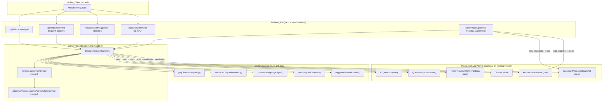
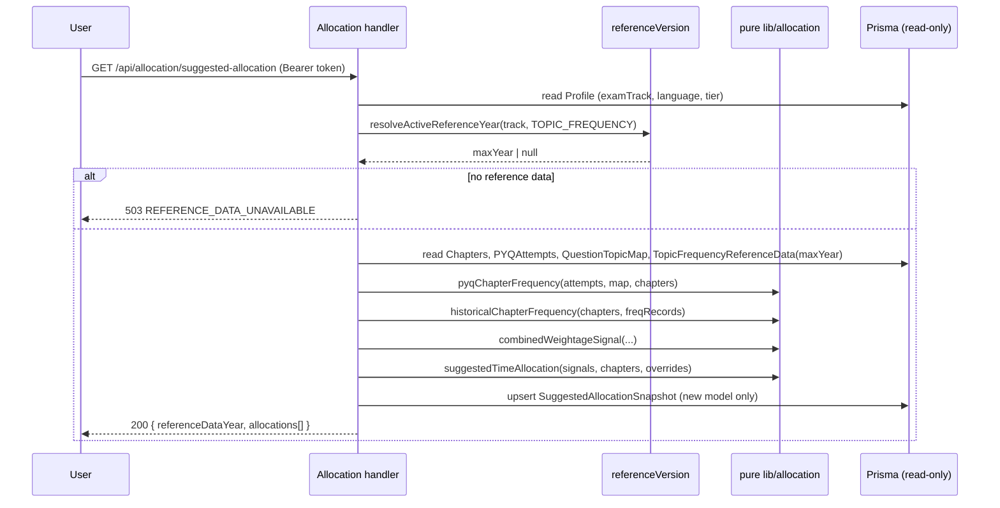

# Design Document

## Overview

Weightage-Based Time Allocation introduces an **Allocation_Service** to the existing Next.js
+ Prisma Backend_API. It is a purely *additive, reuse-only* feature: it reads the User's
already-persisted Phase 1 `PYQAttempt` records, the Performance Analytics `QuestionTopicMap`,
the year-versioned `TopicFrequencyReferenceData`, and the User's own `Chapter` rows, and from
those it derives a single per-Chapter prioritization signal (the **Combined_Weightage_Signal**),
a ranked **Most_Frequent_Chapters** list, and a **Suggested_Time_Allocation** across pending
Chapters. That suggested allocation then becomes an optional *basis* the existing Phase 1
timetable generator consumes in place of its default `Chapter_Weightage`-driven distribution,
while every Phase 1 scheduling behavior (buffer reservation, energy slotting, interleaving,
fixed-commitment avoidance) and every User override is preserved unchanged.

The design follows the established two-layer convention already used throughout the codebase:

- **Pure logic** lives under `src/lib/allocation/` — database- and framework-free functions
  (mirroring `src/lib/timetable/*` and the pure analytics modules like `topicPriority.ts`).
  These are the property-test surface.
- **Thin service handlers** live under `src/services/allocation/` — they read rows through the
  Prisma singleton (`@/lib/db`), call the shared active-version resolver
  (`@/lib/analytics/referenceVersion`), localize via `@/lib/localization`, gate via the shared
  `tierGate`, and delegate all math to the pure layer (mirroring `topicPriorityService.ts`).
- **Route files** under `src/app/api/allocation/*` are one-liners wrapping the handler with
  `withAuth` (mirroring `src/app/api/analytics/*/route.ts`).

The feature reuses the existing JSON error envelope (`@/lib/errors`), the `ErrorCode.REFERENCE_DATA_UNAVAILABLE`
code, the `withAuth`/`assertOwnership` guard, the EN/HI localization catalog and resolver, and
the empty-by-default analytics tier-gate registry.

### Key design decisions

| Decision | Rationale |
| --- | --- |
| New pure module `src/lib/allocation/` rather than extending `src/lib/timetable/allocation.ts` | The Phase 1 allocator turns a weekly hour budget into capped per-chapter hours; this feature computes a *normalized share* from frequency signals. Keeping them separate respects single-responsibility and the "do not redefine the Phase 1 generator" scope constraint. |
| Feed the suggestion into the timetable by mapping each pending Chapter's `Suggested_Time_Allocation` share onto the `AllocatorChapter.weightage` input | The existing `allocateStudyHours` already does a proportional split by effective weightage and already honors `timeAllocationOverride`/`weightageOverride` precedence. Supplying the share as the weightage basis reuses all Phase 1 scheduling untouched (Req 7.4) and makes overrides "just work" (Req 8.1). |
| Persist the latest computed allocation as a per-user snapshot (`SuggestedAllocationSnapshot`) | Req 7.1 requires timetable generation to use the *most recently computed* suggestion, so it must be durable and readable at generation time without recomputation. |
| Store the `Effective_Allocation_Mode` in a new `AllocationPreference` model (not a new column on `Profile`) | Strictly additive (Req 9.3); keeps the Phase 1 `Profile` model untouched and the unset/default state explicit. |
| Min-max normalization of the Combined_Weightage_Signal onto `[0,1]` | Directly satisfies Req 3.2 (max→1, min→0) and matches the normalization approach already proven in `topicPriority.ts`. |

## Architecture



### Authentication posture

Every `/api/allocation/*` route is wrapped with `withAuth` (mirroring the analytics routes),
so a request lacking a valid session is rejected with `401 UNAUTHORIZED` before any handler
runs (Req 10.1). Handlers scope every query by `ctx.user.id` for per-user isolation (Req 10.2)
and call `assertOwnership` (→ `403 FORBIDDEN`) before touching any referenced `PYQAttempt`,
`Chapter`, or `AllocationPreference` (Req 10.3, 10.4). Because the guard treats "not found"
and "not owned" uniformly as a non-ownership case, resource existence is never disclosed
across users (Req 10.4).

### Computation pipeline



## Components and Interfaces

### Pure layer — `src/lib/allocation/`

All functions below are pure (no Prisma, no framework), accept plain rows, and never mutate
their inputs — exactly the convention of `src/lib/timetable/allocation.ts` and
`src/services/analytics/topicPriority.ts`.

#### `frequency.ts` — PYQ and historical frequency

```ts
/** A user per-question outcome resolved from a PYQAttempt's `perQuestion` JSON. */
export interface AttemptQuestionOutcome {
  questionId: string;
  // outcome is carried for completeness but does not affect the count (Req 1.1 counts presence).
}

/** A QuestionTopicMap entry (questionId -> topicKey == Chapter.referenceKey). */
export interface QuestionTopicLink {
  questionId: string;
  topicKey: string;
}

/** Minimal chapter shape the allocation math consumes. */
export interface AllocationChapter {
  id: string;
  referenceKey: string;
  status: 'NOT_STARTED' | 'IN_PROGRESS' | 'DONE' | 'REVISED';
  /** Effective Phase 1 weightage AFTER applying any Weightage_Override (Req 8.2). */
  weightage: number | null;
  /** Phase 1 weightageIsDefault flag, carried through for fallback labeling (Req 6.3). */
  weightageIsDefault: boolean;
}

/**
 * Req 1.1–1.5. For each chapter, count the user's per-question outcomes whose questionId
 * resolves (through a QuestionTopicLink whose topicKey === chapter.referenceKey) to that
 * chapter. Questions with no link contribute to no chapter (Req 1.2). A question whose
 * topicKey matches more than one chapter referenceKey increments each matched chapter by
 * exactly one (Req 1.3). Each outcome is counted at most once per chapter (Req 1.4).
 */
export function pyqChapterFrequency(
  outcomes: readonly AttemptQuestionOutcome[],
  links: readonly QuestionTopicLink[],
  chapters: readonly AllocationChapter[],
): Map<string /* chapterId */, number>;

/** One active Topic_Frequency_Record. */
export interface TopicFrequencyRecord {
  topicKey: string;
  avgQuestionsPerYear: number;
}

export interface HistoricalFrequency {
  value: number;            // avgQuestionsPerYear or 0 (Req 2.1, 2.3, 2.4)
  hasHistoricalData: boolean; // false => "no historical frequency data" label (Req 2.3, 2.4)
}

/**
 * Req 2.1, 2.3, 2.4. Map each chapter to the avgQuestionsPerYear of the active-year
 * Topic_Frequency_Record whose topicKey === chapter.referenceKey, else value 0 with
 * hasHistoricalData=false. Dataset-version selection (Req 2.2) is the caller's job via
 * resolveActiveReferenceYear; this pure fn receives only the already-selected records.
 */
export function historicalChapterFrequency(
  chapters: readonly AllocationChapter[],
  records: readonly TopicFrequencyRecord[],
): Map<string /* chapterId */, HistoricalFrequency>;
```

#### `signal.ts` — Combined_Weightage_Signal

```ts
export interface ChapterSignalInput {
  chapterId: string;
  referenceKey: string;
  pyqFrequency: number;        // >= 0
  historicalFrequency: number; // >= 0
  hasHistoricalData: boolean;
}

export interface ChapterSignal extends ChapterSignalInput {
  /** Pre-normalization combined value: monotonic non-decreasing in each input (Req 3.1). */
  rawSignal: number;
  /** Min-max normalized onto [0,1]; max->1, min->0 (Req 3.2). */
  combinedWeightageSignal: number;
}

/**
 * Req 3.1–3.5. rawSignal = WPYQ * pyqFrequency + WHIST * historicalFrequency, with positive
 * weights, so it is non-negative and non-decreasing in each input while the other is held
 * constant (Req 3.1). When only one input is positive the signal derives from that input
 * alone (Req 3.3, 3.4); both-zero -> rawSignal 0 (Req 3.5). The combinedWeightageSignal is
 * the min-max normalization of rawSignal across the supplied chapters (Req 3.2): the highest
 * raw -> 1, the lowest -> 0; an all-equal set (incl. all-zero) -> 0 for every chapter.
 */
export function combinedWeightageSignal(
  inputs: readonly ChapterSignalInput[],
): ChapterSignal[];

export const SIGNAL_WEIGHTS: { pyq: number; historical: number };
```

#### `ranking.ts` — Most_Frequent_Chapters

```ts
/**
 * Req 4.1, 4.3, 4.4, 4.5, 4.6. Return all chapters ordered by combinedWeightageSignal desc,
 * tie-broken by historicalFrequency desc, then pyqFrequency desc, then referenceKey ascending
 * (lexicographic) for a total, deterministic order. Empty input -> empty list (Req 4.6).
 */
export function mostFrequentChapters(signals: readonly ChapterSignal[]): ChapterSignal[];
```

#### `allocation.ts` — Suggested_Time_Allocation

```ts
export interface SuggestedChapterInput extends ChapterSignal {
  status: 'NOT_STARTED' | 'IN_PROGRESS' | 'DONE' | 'REVISED';
  weightage: number | null;     // effective Phase 1 weightage (override already applied)
  weightageIsDefault: boolean;
  /** A User Time_Allocation_Override share for this chapter, if any (Req 8.1, 8.5). */
  timeAllocationOverride?: number | null;
}

export type AllocationSource = 'COMBINED_SIGNAL' | 'WEIGHTAGE_FALLBACK' | 'USER_OVERRIDE';

export interface ChapterAllocationShare {
  chapterId: string;
  referenceKey: string;
  allocationShare: number;        // [0,1], rounded to 4 dp (Req 5.3)
  source: AllocationSource;       // labeling (Req 6.2, 8.1)
  weightageIsDefault: boolean;    // preserved from input (Req 6.3)
}

/**
 * Req 5, 6, 8. Considers only pending chapters (NOT_STARTED | IN_PROGRESS) (Req 5.2); each
 * pending chapter appears exactly once (Req 6.4). Steps:
 *  1. Overrides first (Req 8.1): each overridden chapter keeps its stored share unchanged.
 *  2. Remaining share R = clamp(1 - Σoverrides, 0, 1) is distributed across non-overridden
 *     chapters in proportion to their combinedWeightageSignal (Req 8.5). If Σoverrides >= 1,
 *     R = 0 and every non-overridden chapter gets 0 (Req 8.6). If all chapters are overridden,
 *     no signal-based distribution occurs (Req 8.7).
 *  3. Among non-overridden chapters, if every signal is 0, fall back to Phase 1 weightage
 *     proportions (Req 5.4). A per-chapter fallback also applies to any chapter with zero pyq
 *     AND no historical record (Req 6.1), labeled WEIGHTAGE_FALLBACK.
 *  4. A fallback chapter whose weightage is absent or 0 receives the smallest non-zero share
 *     among pending chapters and is retained (Req 6.5).
 *  5. Shares are rounded to 4 dp and the largest share absorbs rounding residue so they sum to
 *     1.0 (within 0.001) across included chapters (Req 5.3, 6.1). Empty pending set -> []
 *     (Req 5.5).
 */
export function suggestedTimeAllocation(
  inputs: readonly SuggestedChapterInput[],
): ChapterAllocationShare[];
```

#### `timetableBasis.ts` — mapping the suggestion into Phase 1 generation

```ts
export type EffectiveAllocationMode = 'SUGGESTED' | 'PHASE1_DEFAULT';

/**
 * Req 7.1, 7.2, 7.3, 7.6, 7.7. Decide the per-chapter weightage basis the Phase 1 allocator
 * consumes. When mode === 'SUGGESTED' and the snapshot has at least one pending chapter, each
 * pending chapter's AllocatorChapter.weightage is set to its snapshot allocationShare; chapters
 * absent from the snapshot keep their Phase 1 weightage. Otherwise (PHASE1_DEFAULT, unset mode,
 * or empty snapshot) the Phase 1 weightage is returned unchanged. This never mutates the
 * persisted weightage (Req 7.5) — it only rewrites the in-memory allocator input.
 */
export function resolveTimetableBasis(
  chapters: readonly AllocatorChapterLike[],
  mode: EffectiveAllocationMode | null,
  snapshotShares: ReadonlyMap<string, number>,
): AllocatorChapterLike[];
```

### Service layer — `src/services/allocation/`

| File | Responsibility |
| --- | --- |
| `allocationReader.ts` | Reads `Profile`, pending+all `Chapter`s, the User's `PYQAttempt` rows (parsing `perQuestion` JSON into `AttemptQuestionOutcome[]`), `QuestionTopicMap` entries for the referenced questions, and active-year `TopicFrequencyReferenceData`. Applies `Weightage_Override` precedence (`weightageOverride ?? weightage`) before handing chapters to the pure layer (Req 8.2). |
| `signalService.ts` | `GET /api/allocation/signal` handler → `{ referenceDataYear, chapters: ChapterSignal[] }` (Req 3.6). |
| `mostFrequentService.ts` | `GET /api/allocation/most-frequent-chapters` handler (Req 4). |
| `suggestedAllocationService.ts` | `GET /api/allocation/suggested-allocation` handler; computes shares and upserts the `SuggestedAllocationSnapshot` (Req 5, 6, 8). |
| `modeService.ts` | `GET`/`PUT /api/allocation/mode` handlers; reads/writes `AllocationPreference` (Req 7, 10.3, 10.4). |
| `index.ts` | Barrel exports. |

Each read handler resolves the active reference year via `resolveActiveReferenceYear(track,
ReferenceDatasetType.TOPIC_FREQUENCY)` and returns `503 REFERENCE_DATA_UNAVAILABLE` when it is
`null` (Req 2.4, 3.7, 9.5). Each handler calls `assertTierAllowed(AnalyticsOutput.…, tier)`
right after auth; new tier-gate identifiers are added for the allocation outputs but left
**out** of `PAID_ANALYTICS_OUTPUTS`, so the feature defaults to Free for every tier (Req 12.1,
12.4) while remaining one edit away from Paid designation (Req 12.2, 12.3).

### Timetable integration (reused service, augmented)

`generateTimetableHandler` (`src/services/timetable/timetableGenerationService.ts`) is extended
with a small, additive step: after loading pending chapters it reads the User's
`AllocationPreference.mode` and the latest `SuggestedAllocationSnapshot`, then passes both
through `resolveTimetableBasis(...)` to produce the `AllocatorChapter[]` it already feeds to
`allocateStudyHours`. Everything downstream (buffer reservation, energy slotting, interleaving,
overlap assertion, persistence) is unchanged, preserving all Phase 1 scheduling guarantees
(Req 7.4) and leaving persisted `Chapter.weightage` untouched (Req 7.5).

### API endpoints

| Method & path | Output | Errors |
| --- | --- | --- |
| `GET /api/allocation/signal` | `{ referenceDataYear, chapters: ChapterSignal[] }` | 401, 503 |
| `GET /api/allocation/most-frequent-chapters` | `{ referenceDataYear, chapters: ChapterSignal[] }` | 401, 503 |
| `GET /api/allocation/suggested-allocation` | `{ referenceDataYear, allocations: ChapterAllocationShare[] }` | 401, 503 |
| `GET /api/allocation/mode` | `{ mode }` | 401 |
| `PUT /api/allocation/mode` | `{ mode }` | 401, 422 |

## Data Models

This feature adds **only** new models and one new enum. No existing Phase 1 or Performance
Analytics enum, model, column, or stored value is renamed, removed, retyped, repurposed, or
written by this feature (Req 9.3, 9.4). The new models follow the established conventions: a
uuid `id`, `createdAt`/`updatedAt` timestamps, a `userId` scoping column, and cascade-delete
with `User`.

```prisma
// === Phase 2: Weightage-Based Time Allocation (additive) =====================

enum EffectiveAllocationMode {
  SUGGESTED        // use the most recent Suggested_Time_Allocation as the basis (Req 7.1)
  PHASE1_DEFAULT   // use the Phase 1 Chapter_Weightage-driven distribution (Req 7.2)
}

/// The User-selectable Effective_Allocation_Mode. Absence of a row == "unset", which the
/// timetable generator treats as PHASE1_DEFAULT (Req 7.6).
model AllocationPreference {
  id        String                  @id @default(uuid())
  userId    String                  @unique
  mode      EffectiveAllocationMode @default(PHASE1_DEFAULT)
  createdAt DateTime                @default(now())
  updatedAt DateTime                @updatedAt

  user User @relation(fields: [userId], references: [id], onDelete: Cascade)

  @@index([userId])
}

/// A durable snapshot of the most recently computed Suggested_Time_Allocation for a User,
/// consumed by timetable generation (Req 7.1). One snapshot per user; recomputation upserts.
/// `shares` is the per-chapter result: [{ chapterId, referenceKey, allocationShare, source,
/// weightageIsDefault }]. `referenceDataYear` records the dataset version used (Req 3.6).
model SuggestedAllocationSnapshot {
  id                String   @id @default(uuid())
  userId            String   @unique
  referenceDataYear Int
  shares            Json
  computedAt        DateTime @default(now())
  createdAt         DateTime @default(now())
  updatedAt         DateTime @updatedAt

  user User @relation(fields: [userId], references: [id], onDelete: Cascade)

  @@index([userId])
}
```

The `User` model gains two additive back-relations only (`allocationPreference
AllocationPreference?` and `suggestedAllocationSnapshot SuggestedAllocationSnapshot?`); adding a
back-relation is required by Prisma for the new relations and changes no existing column or
stored value.

### Reused existing models (read-only)

| Model | Fields read | Used for |
| --- | --- | --- |
| `PYQAttempt` | `userId`, `perQuestion` (JSON `[{ questionId, outcome }]`) | PYQ_Chapter_Frequency (Req 1) |
| `QuestionTopicMap` | `questionId`, `topicKey` | resolving questions → Chapter referenceKey (Req 1) |
| `TopicFrequencyReferenceData` | `examTrack`, `referenceDataYear`, `topicKey`, `avgQuestionsPerYear` | Historical_Chapter_Frequency (Req 2) |
| `Chapter` | `id`, `referenceKey`, `status`, `weightage`, `weightageIsDefault`, `weightageOverride`, `timeAllocationOverride` | universe, status filter, fallback, overrides (Req 4, 5, 6, 8) |
| `Profile` | `examTrack`, `language`, `subscriptionTier` | version selection, localization, tier gate (Req 10, 11, 12) |

## Correctness Properties

*A property is a characteristic or behavior that should hold true across all valid executions
of a system — essentially, a formal statement about what the system should do. Properties serve
as the bridge between human-readable specifications and machine-verifiable correctness
guarantees.*

The properties below were derived from the acceptance-criteria prework. Reasoning step by
step: the testable criteria collapse into a compact set after removing redundancy — the many
no-mutation criteria fold into one invariant; the PYQ-frequency special cases (unmapped, multi-
match, empty) are generator-covered cases of one counting rule; the combined-signal special
cases are covered by a monotonicity property plus a normalization property; the suggested-
allocation distribution, fallback, and override behaviors each become one comprehensive
property. UI rendering timing (11.1) and the architectural source constraints (9.1, 9.2) are
verified by integration tests and review, not properties; the schema-additive constraint (9.3)
and catalog completeness (11.4) are smoke tests.

### Property 1: PYQ_Chapter_Frequency counts mapped, owned per-question outcomes

*For any* set of a User's `PYQAttempt` per-question outcomes, any `QuestionTopicMap`, and any
set of the User's Chapters, each Chapter's `PYQ_Chapter_Frequency` equals the number of that
User's per-question outcomes whose `questionId` resolves — through a `QuestionTopicMap` entry
whose `topicKey` equals the Chapter's `referenceKey` — to that Chapter; a question with no map
entry contributes to no Chapter, a question whose `topicKey` matches multiple Chapter
`referenceKey`s increments each matched Chapter by exactly one, each outcome is counted at most
once per Chapter, and a User with no attempts yields zero for every Chapter.

**Validates: Requirements 1.1, 1.2, 1.3, 1.4, 1.5**

### Property 2: Historical_Chapter_Frequency equals active-year average or zero

*For any* set of Chapters and any year-versioned `TopicFrequencyReferenceData`, each Chapter's
`Historical_Chapter_Frequency` equals the `avgQuestionsPerYear` of the `Topic_Frequency_Record`
whose `topicKey` matches the Chapter's `referenceKey` in the greatest available
`Reference_Data_Year` for the track; when no such record exists, or no dataset exists for the
track, the value is zero and the Chapter is labeled as having no historical frequency data.

**Validates: Requirements 2.1, 2.2, 2.3, 2.4**

### Property 3: Combined_Weightage_Signal is non-negative and monotonic

*For any* Chapter, the pre-normalization `Combined_Weightage_Signal` is non-negative and does
not decrease when either `PYQ_Chapter_Frequency` or `Historical_Chapter_Frequency` increases
while the other is held constant; a Chapter with only one positive input derives its signal
from that input alone, and a Chapter with both inputs zero contributes a raw signal of zero.

**Validates: Requirements 3.1, 3.3, 3.4, 3.5**

### Property 4: Combined_Weightage_Signal normalizes onto [0,1]

*For any* non-empty set of Chapters, every normalized `Combined_Weightage_Signal` lies in the
inclusive range 0 to 1, the Chapter with the highest pre-normalization signal is assigned 1 and
the Chapter with the lowest is assigned 0, and when every Chapter's pre-normalization signal is
equal (including the all-zero case) every Chapter is assigned 0.

**Validates: Requirements 3.2, 3.5**

### Property 5: Most_Frequent_Chapters ordering is total and deterministic

*For any* set of Chapters, the `Most_Frequent_Chapters` list contains every Chapter ordered by
`Combined_Weightage_Signal` descending, breaking ties by `Historical_Chapter_Frequency`
descending, then by `PYQ_Chapter_Frequency` descending, then by Chapter `referenceKey` in
ascending lexicographic order, producing the same order regardless of input order; an empty
Chapter set yields an empty list.

**Validates: Requirements 4.1, 4.3, 4.4, 4.5, 4.6**

### Property 6: Frequency outputs carry their component values and reference year

*For any* returned Chapter in the signal or `Most_Frequent_Chapters` output, the entry includes
that Chapter's `PYQ_Chapter_Frequency`, `Historical_Chapter_Frequency`, and
`Combined_Weightage_Signal`, and the response includes the `Reference_Data_Year` of the
`TopicFrequencyReferenceData` used in the computation.

**Validates: Requirements 4.2, 3.6**

### Property 7: Suggested allocation shares are proportional and sum to one

*For any* set of pending Chapters with at least one positive `Combined_Weightage_Signal` and no
User overrides, each Chapter's `Allocation_Share` equals its `Combined_Weightage_Signal` divided
by the sum of the included Chapters' signals, a strictly higher signal yields a strictly higher
share, every share lies in 0.0 to 1.0 rounded to 4 decimal places, and the shares sum to 1.0
within a tolerance of 0.001.

**Validates: Requirements 5.1, 5.3, 6.1**

### Property 8: Suggested allocation covers exactly the pending Chapters once

*For any* set of Chapters, the `Suggested_Time_Allocation` includes every Chapter whose
`Chapter_Status` is Not Started or In Progress exactly once and excludes every Chapter whose
status is neither; when there are no pending Chapters the allocation is empty.

**Validates: Requirements 5.2, 6.4, 5.5**

### Property 9: Chapter_Weightage fallback retains and labels data-less Chapters

*For any* pending Chapter that has a `PYQ_Chapter_Frequency` of zero and no historical record
(or any set whose signals are all zero), the Chapter's `Allocation_Share` is derived in
proportion to its effective Phase 1 `Chapter_Weightage` (normalized so all pending shares sum to
1.0 within 0.001), the Chapter is labeled as originating from the `Chapter_Weightage` fallback,
its `weightageIsDefault` flag is preserved, and a fallback Chapter whose weightage is absent or
zero receives the smallest non-zero `Allocation_Share` among the pending Chapters and is retained
rather than dropped.

**Validates: Requirements 5.4, 6.1, 6.2, 6.3, 6.5**

### Property 10: User overrides take precedence and the remainder is distributed by signal

*For any* set of pending Chapters where some carry a `Time_Allocation_Override`, each overridden
Chapter keeps its stored override share unchanged, the remaining share equal to 1.0 minus the
sum of the overridden shares is distributed across the non-overridden Chapters in proportion to
their `Combined_Weightage_Signal`; when the sum of overrides meets or exceeds 1.0 every
non-overridden Chapter receives a share of zero and no override value is reduced; when every
pending Chapter is overridden no signal-based distribution is performed; and any
`Weightage_Override` replaces the Phase 1 `Chapter_Weightage` in every computation that would
otherwise use it.

**Validates: Requirements 8.1, 8.2, 8.5, 8.6, 8.7**

### Property 11: Timetable basis selection honors mode and snapshot

*For any* `Effective_Allocation_Mode` and most-recent `Suggested_Time_Allocation` snapshot, when
the mode is SUGGESTED and the snapshot contains at least one pending Chapter the per-Chapter time
distribution basis equals the snapshot's `Allocation_Share`s restricted to pending Chapters;
otherwise — the mode is the Phase 1 default, the mode is unset, or the snapshot is empty — the
basis equals the Phase 1 `Chapter_Weightage` distribution; in all cases the persisted Phase 1
`Chapter_Weightage` values are returned unchanged.

**Validates: Requirements 7.1, 7.2, 7.3, 7.5, 7.6, 7.7**

### Property 12: Computations never mutate existing records

*For any* allocation computation (signal, most-frequent, suggested-allocation, or timetable-basis
resolution), no `PYQAttempt`, `QuestionTopicMap`, `PYQ`, `TopicFrequencyReferenceData`, or
existing `Chapter` value (including `weightage`, `weightageOverride`, and `timeAllocationOverride`)
is created, updated, or deleted.

**Validates: Requirements 1.6, 2.5, 7.5, 8.3, 9.4**

### Property 13: Outputs are isolated to the requesting User

*For any* two Users' data, a User's allocation outputs are computed exclusively from that User's
own owned data together with the system-supplied `TopicFrequencyReferenceData` and
`QuestionTopicMap`; another User's `PYQAttempt`s, Chapters, or preferences never affect the
result.

**Validates: Requirements 10.2, 1.4**

### Property 14: Missing required inputs yield a missing-input response and no output

*For any* request whose required inputs are absent — in particular when no
`TopicFrequencyReferenceData` exists for the User's track — the service produces no
`Combined_Weightage_Signal` or `Suggested_Time_Allocation`, returns a response indicating the
reference-data-unavailable / missing-input condition, and leaves all existing records unchanged.

**Validates: Requirements 2.4, 3.7, 9.5**

### Property 15: Tier gating defaults open and blocks only designated outputs

*For any* allocation output and any `Subscription_Tier`, while the output carries no Paid-tier
designation the request is granted to every tier; once an output is designated Paid-tier, a Free
tier request for it is rejected with an upgrade-required response carrying no output data, and a
Paid tier request for it is granted.

**Validates: Requirements 12.1, 12.4**

### Property 16: Localized strings fall back to English

*For any* requested allocation label and any `Language_Preference`, when the preference is absent
or is neither English nor Hindi the English string is returned, and when a localized value for
the selected language is unavailable the non-empty English string is returned rather than an
empty value, placeholder key, or blank label.

**Validates: Requirements 11.2, 11.3**

## Error Handling

All failures use the shared JSON error envelope `{ error: { code, message, details? } }` from
`@/lib/errors`, reusing existing `ErrorCode`s — no new codes are introduced.

| Condition | HTTP | `ErrorCode` | Notes |
| --- | --- | --- | --- |
| Missing/malformed/expired session token | 401 | `UNAUTHORIZED` | Enforced by `withAuth` before the handler runs (Req 10.1). |
| Referenced `PYQAttempt`/`Chapter`/mode setting not owned, or not existing | 403 | `FORBIDDEN` | `assertOwnership` treats not-found and not-owned identically, so existence is never disclosed (Req 10.3, 10.4). |
| No active `TopicFrequencyReferenceData` for the User's track (or other required input absent) | 503 | `REFERENCE_DATA_UNAVAILABLE` | Resolver returns `null`; no signal/allocation produced; records untouched (Req 2.4, 3.7, 9.5). |
| User has no `Profile`/Exam_Track (onboarding incomplete) | 404 | `NOT_FOUND` | Mirrors `topicPriorityService`/`topicTrendService`. |
| Invalid `PUT /api/allocation/mode` body (mode not one of the enum values) | 422 | `VALIDATION_ERROR` | `details: { param: 'mode' }`. |
| Free-tier request for a Paid-designated output (only if later designated) | 402 | `UPGRADE_REQUIRED` | Returned by `assertTierAllowed`; no output data in the body (Req 12.2). |

Domain edge cases handled in the pure layer (not errors): empty Chapter set → empty outputs;
no pending Chapters → empty allocation; all-zero signals → `Chapter_Weightage` fallback;
malformed/empty `perQuestion` JSON in a `PYQAttempt` → that attempt contributes zero outcomes
(read defensively, never throws). The localization resolver never throws — it always falls back
to English (Req 11.2, 11.3).

## Testing Strategy

PBT is appropriate here: the core of this feature is a set of **pure functions** (frequency
counting, signal combination, normalization, deterministic ordering, share distribution,
override handling, basis selection) with clear input/output behavior and universal properties
over a large input space. The pure `src/lib/allocation/*` modules are the property-test surface,
mirroring the established `src/lib/timetable/*` and `src/services/analytics/*.property.test.ts`
patterns.

### Dual approach

- **Property-based tests** (one per correctness property, Properties 1–16) verify universal
  behavior across generated inputs. They live beside the pure modules
  (`src/lib/allocation/*.property.test.ts`) and the services that own isolation/gating/fallback
  semantics (`src/services/allocation/*.property.test.ts`).
- **Unit / example tests** cover specific scenarios and transitions: response includes
  `referenceDataYear` (3.6), clearing an override then recomputing resumes the suggestion (8.4),
  Paid-designated output gating for Free vs Paid users (12.2, 12.3), and ownership/non-disclosure
  responses (10.3, 10.4).
- **Integration tests** cover wiring that does not vary meaningfully with input: unauthenticated
  requests to each route return 401 (10.1), timetable generation with mode SUGGESTED preserves
  the Phase 1 buffer/overlap/energy/interleave behaviors (7.4), and handlers read only the
  declared data sources (9.1, 9.2) — following `analyticsAuth.integration.test.ts` and
  `analyticsFlows.integration.test.ts`.
- **Smoke tests** cover one-shot checks: the Prisma migration adds only the new enum and the two
  new models (9.3), and every new `allocation.*` localization key has non-empty `en` and `hi`
  values (11.4) — following `analyticsCatalog.smoke.test.ts`.

Requirement 11.1 (client renders localized text within 200 ms) is a Mobile_Client rendering and
performance concern outside this Backend_API design's testable scope.

### Property test library and configuration

- Use **fast-check** (already the project's property-testing library, per the existing
  `*.property.test.ts` suites) with **Vitest**. Do not hand-roll generators or a PBT harness.
- Each property test runs a **minimum of 100 iterations** (`fc.assert(..., { numRuns: 100 })`).
- Each property test is tagged with a comment referencing its design property in the form:
  **Feature: weightage-based-time-allocation, Property {number}: {property text}**
- Run a single execution (no watch mode), e.g. `npx vitest --run`.

### Representative generators

- Chapters: random `referenceKey` (including duplicates so multi-match per Property 1 is
  exercised), random `status` across all four values, random/absent `weightage`, random
  `weightageIsDefault`, optional `weightageOverride`/`timeAllocationOverride`.
- Attempts: random `perQuestion` arrays with `questionId`s that sometimes have, and sometimes
  lack, a `QuestionTopicMap` entry; include empty-attempt and empty-`perQuestion` cases.
- Reference data: multiple `referenceDataYear`s per track (to exercise max-year selection),
  records that cover some Chapters and omit others, and the empty-dataset case.
- Two-user fixtures for the isolation property (Property 13).
